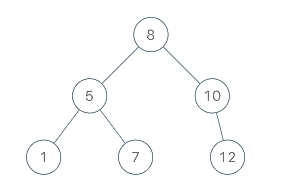

# 1008. Construct Binary Search Tree from Preorder Traversal


Given an array of integers preorder, which represents the **preorder traversal** of a BST (i.e., **binary search tree**), construct the tree and return *its root.*

It is **guaranteed** that there is always possible to find a binary search tree with the given requirements for the given test cases.

A **binary search tree** is a binary tree where for every node, any descendant of `Node.left` has a value **strictly less than** Node.val, and any descendant of `Node.right` has a value **strictly greater than** `Node.val`.

A **preorder traversal** of a binary tree displays the value of the node first, then traverses `Node.left`, then traverses `Node.right`.

 

**Example 1:**



>Input: preorder = [8,5,1,7,10,12]  
Output: [8,5,10,1,7,null,12]  

**Example 2:**

>Input: preorder = [1,3]  
Output: [1,null,3]  
 

**Constraints:**

* `1 <= preorder.length <= 100`
* `1 <= preorder[i] <= 1000`
* All the values of `preorder` are **unique**.

## DFS

```python
# Definition for a binary tree node.
# class TreeNode:
#     def __init__(self, val=0, left=None, right=None):
#         self.val = val
#         self.left = left
#         self.right = right
class Solution:
    
    def __init__(self):
        self.idx = 0

    def bstFromPreorder(self, preorder: List[int]) -> Optional[TreeNode]:
        
        def build(low=float('-inf'), high=float('inf')):

            if self.idx == len(preorder):       # reach the end, no more elements
                return
            
            cur_val = preorder[self.idx]

            if cur_val < low or cur_val > high: # no matter LEFT/RIGHT, cur_val is out of boundry
                return

            root = TreeNode(cur_val)
            self.idx += 1
                                                # use cur_val as the new boundry
            root.left = build(low, cur_val)     # keep going left, INT_MIN < 1 < 5 < 8
            root.right = build(cur_val, high)   # keep going right, 7 < 10 < 12 < INT_MAX
            return root
        
        return build()
```
