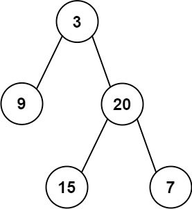

# 105. Construct Binary Tree from Preorder and Inorder Traversal

Given two integer arrays `preorder` and `inorder` where `preorder` is the preorder traversal of a binary tree and `inorder` is the inorder traversal of the same tree, construct and return *the binary tree*.

 

**Example 1:**


>**Input:** `preorder = [3,9,20,15,7], inorder = [9,3,15,20,7]`  
**Output:** `[3,9,20,null,null,15,7]`


**Example 2:**

>**Input:** `preorder = [-1], inorder = [-1]`  
**Output:** `[-1]`
 

**Constraints:**

* `1 <= preorder.length <= 3000`
* `inorder.length == preorder.length`
* `-3000 <= preorder[i], inorder[i] <= 3000`
* `preorder` and `inorder` consist of **unique** values.
* Each value of `inorder` also appears in `preorder`.
* `preorder` is **guaranteed** to be the preorder traversal of the tree.
* `inorder` is **guaranteed** to be the inorder traversal of the tree.


## Solution
```python
# Definition for a binary tree node.
# class TreeNode:
#     def __init__(self, val=0, left=None, right=None):
#         self.val = val
#         self.left = left
#         self.right = right
class Solution:
    def buildTree(self, preorder: List[int], inorder: List[int]) -> Optional[TreeNode]:
        # core logic
        # 1. get root from preorder[0]
        # 2. find index of this root of the inorder list
        # 3. calculate the index of left and right subtree for next recursion
        # KEY: numbers of nodes of left and right subtree are always the same
        # number of nodes of preorder left tree: x - (preleft + 1) + 1
        # number of nodes of inorder left tree: inroot - 1 - inleft + 1
        # x = inroot - inleft + preleft
        # preorder, [root] + [all nodes from left tree preorder] + [all nodes from right tree preorder]
        #         (preleft) (preleft+1) (inroot - inleft + preleft)(inroot - inleft + preleft + 1) (preright)      
        # inorder, [all nodes from left tree inorder] + [root] + [all nodes from right tree inorder] 
        #          (inleft)                 (inroot-1)  (inroot) (inroot+1)                   (inright)
        # keep sending both left subtree into next recursion
        
        # preorder = [3,9,20,15,7]
        # inorder  = [9,3,15,20,7]

        # traverse inorder and save index to hash table
        index = {ele: i for i, ele in enumerate(inorder)}

        def build(preleft, preright, inleft, inright):
            # KEY: exit condition: preleft > preright, no elements in the list, quit recursion
            if preleft > preright:
                return None

            # create root node of current left part
            root = TreeNode(preorder[preleft])
            # find index of this root of inorder list
            inroot = index[root.val]
            # build left subtree recursively, send in left part of both list
            root.left = build(preleft+1, inroot-inleft+preleft, inleft, inroot-1)
            # build right subtree recursively, send in right part of both list
            root.right = build(inroot-inleft+preleft+1, preright, inroot+1, inright)
            return root
        # always the same length
        n = len(preorder)
        return build(0, n - 1, 0, n - 1)
```
