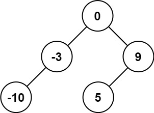

# 108. Convert Sorted Array to Binary Search Tree

Given an integer array `nums` where the elements are sorted in **ascending order**, convert *it to a 
**height-balanced** binary search tree.*

ps: A height-balanced binary tree is a binary tree in which the depth of the two subtrees of every node never differs by more than one.

**Example 1:**




**Input**: nums = [-10,-3,0,5,9]  
**Output**: [0,-3,9,-10,null,5]  
**Explanation**: [0,-10,5,null,-3,null,9] is also accepted:  


**Example 2:**


**Input**: nums = [1,3]   
**Output**: [3,1]  
**Explanation**: [1,null,3] and [3,1] are both height-balanced BSTs.  
 

**Constraints:**

* `1 <= nums.length <= 104`
* `-104 <= nums[i] <= 104`
* `nums` is sorted in a **strictly increasing** order.

## Divide and Conquer

```python
# Definition for a binary tree node.
# class TreeNode:
#     def __init__(self, val=0, left=None, right=None):
#         self.val = val
#         self.left = left
#         self.right = right
class Solution:
    def sortedArrayToBST(self, nums: List[int]) -> Optional[TreeNode]:
        # divide and conquer
        # recursion end condition
        if not nums:
            return
        n = len(nums)
        mid = n // 2
        root = TreeNode(val=nums[mid])
        root.left = self.sortedArrayToBST(nums[:mid])
        root.right = self.sortedArrayToBST(nums[mid+1:])
        return root
```
