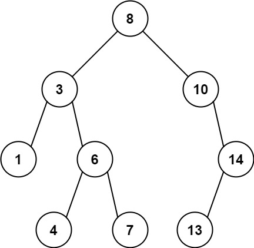
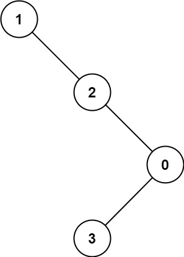

# 1026. Maximum Difference Between Node and Ancestor

Given the `root` of a binary tree, find the maximum value `v` for which there exist different nodes `a` and `b` where `v = |a.val - b.val|` and `a` is an ancestor of `b`.

A node `a` is an ancestor of `b` if either: any child of `a` is equal to `b` or any child of `a` is an ancestor of `b`.


**Example 1:**



>Input: root = [8,3,10,1,6,null,14,null,null,4,7,13]  
Output: 7  
Explanation: We have various ancestor-node differences, some of which are given below :  
|8 - 3| = 5  
|3 - 7| = 4  
|8 - 1| = 7  
|10 - 13| = 3  
Among all possible differences, the maximum value of 7 is obtained by |8 - 1| = 7. 


**Example 2:**



>Input: root = [1,null,2,null,0,3]    
Output: 3    
 

**Constraints:**

* The number of nodes in the tree is in the range `[2, 5000]`.
* `0 <= Node.val <= 105`


## DFS (JAVA)

```java
/**
 * Definition for a binary tree node.
 * public class TreeNode {
 *     int val;
 *     TreeNode left;
 *     TreeNode right;
 *     TreeNode() {}
 *     TreeNode(int val) { this.val = val; }
 *     TreeNode(int val, TreeNode left, TreeNode right) {
 *         this.val = val;
 *         this.left = left;
 *         this.right = right;
 *     }
 * }
 */
class Solution {

    int maxDiff = 0;

    public int maxAncestorDiff(TreeNode root) {
        // start from root, max and min is root itself
        dfs(root, root.val, root.val);
        return maxDiff;
    }

    private void dfs(TreeNode curr, int currMin, int currMax){
        if (curr == null){
            return;
        }
        
        // calculate max difference for current node
        int currMaxDiff = Math.max(Math.abs(curr.val - currMin), Math.abs(curr.val - currMax));
        // update maxDiff
        maxDiff = Math.max(maxDiff, currMaxDiff);
        
        // update max and min for subtrees
        currMax = Math.max(curr.val, currMax);
        currMin = Math.min(curr.val, currMin);

        dfs(curr.left, currMin, currMax);
        dfs(curr.right, currMin, currMax);
        return;
    }
}
```

## DFS (Python)

```python
# Definition for a binary tree node.
# class TreeNode:
#     def __init__(self, val=0, left=None, right=None):
#         self.val = val
#         self.left = left
#         self.right = right
class Solution:

    def __init__(self):
        self.max_diff = 0

    def maxAncestorDiff(self, root: Optional[TreeNode]) -> int:
        # update MIN & MAX
        def dfs(curr, cmin, cmax):
            if not curr:
                return
            # compute current max diff between root&left, root&right, choose the bigger one
            self.max_diff = max(self.max_diff, abs(cmax - curr.val), abs(cmin - curr.val))

            # keep going left and right to update min & max for subtrees
            cmin, cmax = min(curr.val, cmin), max(curr.val, cmax)
            dfs(curr.left, cmin, cmax)
            dfs(curr.right, cmin, cmax)    
            return self.max_diff

        return dfs(root, root.val, root.val)
```
