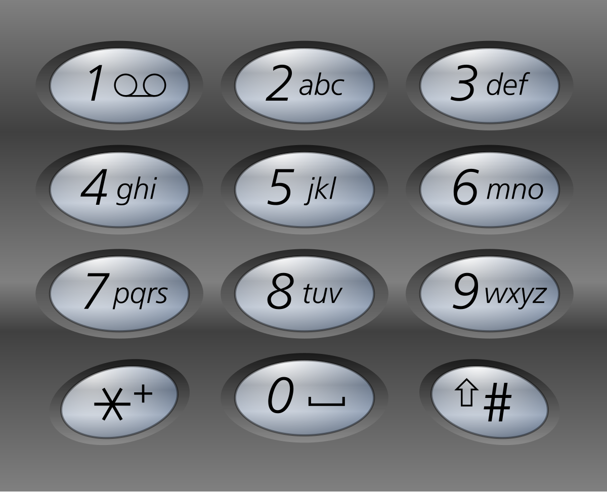

# 17. Letter Combinations of a Phone Number

Given a string containing digits from `2-9` inclusive, return all possible letter combinations that the number could represent. Return the answer in **any order**.

A mapping of digits to letters (just like on the telephone buttons) is given below. Note that 1 does not map to any letters.


**Example 1:**



>Input: digits = "23"  
Output: ["ad","ae","af","bd","be","bf","cd","ce","cf"]  

**Example 2:**

>Input: digits = ""
Output: []

**Example 3:**

>Input: digits = "2"  
Output: ["a","b","c"]  
 

**Constraints:**

* `0 <= digits.length <= 4`
* `digits[i]` is a digit in the range `['2', '9']`.


## Pattern

* **For Loop** traverse **horizontally**
* **Recursion** traverse **vertically**(control the number of for loops)
* **backtracking** continuously adjusts the **result** set.

```python
for i in range(len(currentGroup)):
    path.add(currentGroup[i])
    backtracking(allGroups, allGroupIndex + 1)
    path.pop()
```

1. Combination of different GROUPs("23") of elements("abc", "def").
2. **Recursion**, **index** increase on the **GROUPs**.
3. **Loop**, for loop within current GROUP.


## BackTracking

```python
class Solution:
    def letterCombinations(self, digits: str) -> List[str]:
        dic = {
            "0": "",
            "1": "",
            "2": "abc",
            "3": "def",
            "4": "ghi",
            "5": "jkl",
            "6": "mno",
            "7": "pqrs",
            "8": "tuv",
            "9": "wxyz",
        }

        def backtracking(digits, index):
            if len(path) == n:     # keep going until path length reach target
                res.append("".join(path))
                return

            num = digits[index]
            chars = dic[num]                # backtracking by startIndex within same GROUPs
            for i in range(len(chars)):     # current GROUP "abc"
                path.append(chars[i])
                backtracking(digits, index + 1)   # next GROUP "def", recursion among different GROUPs
                path.pop()

        n = len(digits)     # number of GRUOPs to select
        path = []
        res = []

        if n == 0:
            return res

        backtracking(digits, 0)
        return res
```
