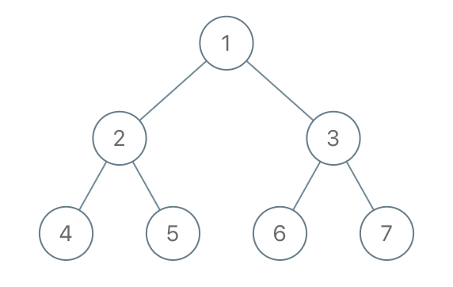

# 1110. Delete Nodes And Return Forest

Given the `root` of a binary tree, each node in the tree has a distinct value.

After deleting all nodes with a value in `to_delete`, we are left with a forest (a disjoint union of trees).

Return the roots of the trees in the remaining forest. You may return the result in any order.

 

**Example 1:**



>**Input**: root = [1,2,3,4,5,6,7], to_delete = [3,5]  
**Output**: [[1,2,null,4],[6],[7]]  


**Example 2:**

>**Input**: root = [1,2,4,null,3], to_delete = [3]  
**Output**: [[1,2,4]]  
 

**Constraints:**

* The number of nodes in the given tree is at most `1000`.
* Each node has a distinct value between `1` and `1000`.
* `to_delete.length <= 1000`
* to_delete contains distinct values between `1` and `1000`.


## DFS: PostOrder Traversal

```python
# Definition for a binary tree node.
# class TreeNode:
#     def __init__(self, val=0, left=None, right=None):
#         self.val = val
#         self.left = left
#         self.right = right
class Solution:
    def delNodes(self, root: Optional[TreeNode], to_delete: List[int]) -> List[TreeNode]:
        # DFS: postorder traversal
        res = []
        def dfs(root):
            if not root:
                return

            # traverse both left and right
            root.left = dfs(root.left)
            root.right = dfs(root.right)

            # back to current root
            # current root should be deleted, add subroots to result
            if root.val in to_delete:
                if root.left:
                    res.append(root.left)
                if root.right:
                    res.append(root.right)
                # return None to disconnect from parent
                return 
            
            # return root itself if not in the list
            return root
        # KEY: if root is deleted, we get None; if root remains, we should add it to result
        root = dfs(root)
        if root:
            res.append(root)
        return res
```
