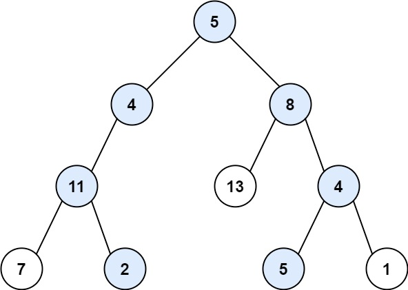
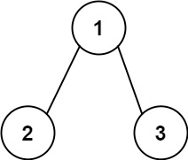

# 113. Path Sum II

Given the `root` of a binary tree and an integer `targetSum`, return *all **root-to-leaf** paths where the sum of the node values in the path equals `targetSum`. Each path should be returned as a list of the node `values`, not node references*.

A **root-to-leaf** path is a path starting from the root and ending at any leaf node. A **leaf** is a node with no children.


**Example 1:**



>**Input:** `root = [5,4,8,11,null,13,4,7,2,null,null,5,1], targetSum = 22`  
**Output:** `[[5,4,11,2],[5,8,4,5]]`  
**Explanation:** `There are two paths whose sum equals targetSum:`  
`5 + 4 + 11 + 2 = 22`  
`5 + 8 + 4 + 5 = 22`  


**Example 2:**



>**Input:** `root = [1,2,3], targetSum = 5`  
**Output:** `[]`  


**Example 3:**

>**Input:** `root = [1,2], targetSum = 0`  
**Output:** `[]`  
 

**Constraints:**

* The number of nodes in the tree is in the range `[0, 5000]`.
* `-1000 <= Node.val <= 1000`
* `-1000 <= targetSum <= 1000`

## Solution
```python
# Definition for a binary tree node.
# class TreeNode:
#     def __init__(self, val=0, left=None, right=None):
#         self.val = val
#         self.left = left
#         self.right = right
class Solution:
    def pathSum(self, root: Optional[TreeNode], targetSum: int) -> List[List[int]]:
        """
        DFS, Backtracking
        deduction, check sum == 0 is also an alternative solution
        """
        res = list()
        def dfs(root, path, total):
            
            if not root: return

            # []         0 + 5 = 5
            # [5]        4 + 5 = 9
            # [5, 4]     11 + 9 = 20
            # [5, 4, 11] 2 + 20 = 22
            total += root.val
            # must end at leaf node to avoid duplicate paths
            if not root.left and not root.right and total == targetSum:
                # remember to add current val into path
                res.append(path + [root.val])
                return

            # add current val into Path and current Sum
            dfs(root.left, path + [root.val], total)
            dfs(root.right, path + [root.val], total)

        dfs(root, [], 0)
        return res
```
