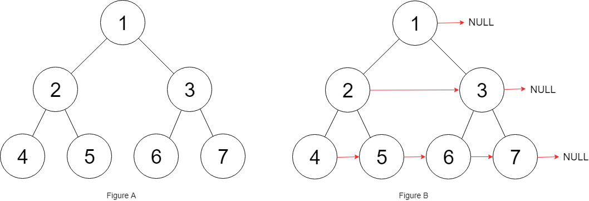

# 116. Populating Next Right Pointers in Each Node

You are given a **perfect binary tree** where all leaves are on the same level, and every parent has two children. The binary tree has the following definition:

>struct Node {  
  int val;  
  Node *left;  
  Node *right;  
  Node *next;  
}  

Populate each next pointer to point to its next right node. If there is no next right node, the next pointer should be set to `NULL`.

Initially, all next pointers are set to `NULL`.

 

**Example 1:**



**Input**: root = [1,2,3,4,5,6,7]
**Output**: [1,#,2,3,#,4,5,6,7,#]
**Explanation**: Given the above perfect binary tree (Figure A), your function should populate each next pointer to point to its next right node, just like in Figure B. The serialized output is in level order as connected by the next pointers, with '#' signifying the end of each level.


**Example 2:**

>**Input**: root = []  
**Output**: []  
 

**Constraints:**

* The number of nodes in the tree is in the range `[0, 212 - 1]`.
* `-1000 <= Node.val <= 1000`
 

**Follow-up:**

You may only use constant extra space.
The recursive approach is fine. You may assume implicit stack space does not count as extra space for this problem.


## Smart Way
Adding the next level recursively, right node first, 7,6,5,4


```python
"""
# Definition for a Node.
class Node:
    def __init__(self, val: int = 0, left: 'Node' = None, right: 'Node' = None, next: 'Node' = None):
        self.val = val
        self.left = left
        self.right = right
        self.next = next
"""

class Solution:
    def connect(self, root: 'Optional[Node]') -> 'Optional[Node]':
        if not root:
            return root
        queue = collections.deque([root])
        while queue:
            # store current right node for each level
            right_node = None
            for _ in range(len(queue)):
                cur = queue.popleft()
                cur.next = right_node
                right_node = cur
                
                if cur.right:
                    # adding next level children reversely, 7, 6, 5, 4
                    # so the right node will always be the first pop
                    queue.append(cur.right)
                    queue.append(cur.left)
        return root
```


## Regular Way(Slow)
```python
"""
# Definition for a Node.
class Node:
    def __init__(self, val: int = 0, left: 'Node' = None, right: 'Node' = None, next: 'Node' = None):
        self.val = val
        self.left = left
        self.right = right
        self.next = next
"""
class Solution:
    """# level traverse"""
    def connect(self, root: 'Optional[Node]') -> 'Optional[Node]':
        if not root:
            return root
        queue = [root]
        while queue:
            level = list()
            for _ in range(len(queue)):
                cur = queue.pop(0)  # pop left
                level.append(cur)
                if cur.left:
                    queue.append(cur.left)
                if cur.right:
                    queue.append(cur.right)
            # all current level nodes stored in level list
            for i in range(1, len(level)):
                level[i - 1].next = level[i]
            # last node in level
            level[-1].next = None
        return root
```
