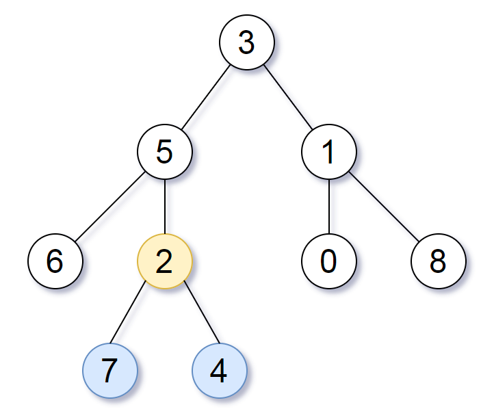

# 1123. Lowest Common Ancestor of Deepest Leaves

Given the `root` of a binary tree, return the *lowest common ancestor of its deepest leaves.*

Recall that:

The node of a binary tree is a leaf if and only if it has no children
The depth of the root of the tree is `0`. if the depth of a node is d, the depth of each of its children is `d + 1`.
The lowest common ancestor of a set `S` of nodes, is the node `A` with the largest depth such that every node in `S` is in the subtree with root `A`.
 

**Example 1:**



**Input:** `root = [3,5,1,6,2,0,8,null,null,7,4]`  
**Output:** `[2,7,4]`  
**Explanation:** `We return the node with value 2, colored in yellow in the diagram.`  
`The nodes coloured in blue are the deepest leaf-nodes of the tree.`  
`Note that nodes 6, 0, and 8 are also leaf nodes, but the depth of them is 2, but the depth of nodes 7 and 4 is 3.`

**Example 2:**

**Input:** `root = [1]`  
**Output:** `[1]`  
**Explanation:** `The root is the deepest node in the tree, and it's the lca of itself.`


**Example 3:**

>**Input:** `root = [0,1,3,null,2]`  
**Output:** `[2]`  
**Explanation:** `The deepest leaf node in the tree is 2, the lca of one node is itself.`
 

**Constraints:**

* The number of nodes in the tree will be in the range `[1, 1000]`.
* `0 <= Node.val <= 1000`
* The values of the nodes in the tree are **unique**.


## Solution
```python
# Definition for a binary tree node.
# class TreeNode:
#     def __init__(self, val=0, left=None, right=None):
#         self.val = val
#         self.left = left
#         self.right = right
class Solution:
    def lcaDeepestLeaves(self, root: Optional[TreeNode]) -> Optional[TreeNode]:
        """DFS, left and right depth comparison, depth added while returning"""
        def dfs(root):
            # reach the end, no depth increment
            if not root:
                return 0, None
            # depth keeps being added when returns
            left_depth, left_lca = dfs(root.left)
            right_depth, right_lca = dfs(root.right)

            # if the left is deeper, the lca is in the left tree
            if left_depth > right_depth:
                return left_depth + 1, left_lca
            # if the right is deeper, the lca is in the right tree
            if right_depth > left_depth:
                return right_depth + 1, right_lca
            # if depth is the same, current node is the lca
            return left_depth + 1, root
        return dfs(root)[1]
```
