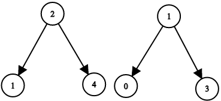
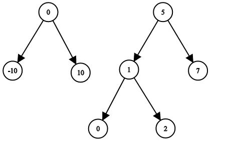

# 1214. Two Sum BSTs


Given the roots of two binary search trees, `root1` and `root2`, return `true` if and only if there is a node in the first tree and a node in the second tree whose values sum up to a given integer `target`.

 

**Example 1:**




>**Input:** `root1 = [2,1,4], root2 = [1,0,3], target = 5`    
**Output:** `true`    
**Explanation:** `2 and 3 sum up to 5.`


**Example 2:**



>**Input:** `root1 = [0,-10,10], root2 = [5,1,7,0,2], target = 18`  
**Output:** `false`  
 

**Constraints:**

* The number of nodes in each tree is in the range `[1, 5000]`.  
* `-109 <= Node.val, target <= 109`

## BST Definition
```python
# Definition for a binary tree node.
# class TreeNode:
#     def __init__(self, val=0, left=None, right=None):
#         self.val = val
#         self.left = left
#         self.right = right
class Solution:
    def twoSumBSTs(self, root1: Optional[TreeNode], root2: Optional[TreeNode], target: int) -> bool:
        # BST definition
        stack = [root1]
        while stack:
            # KEY, remember to refresh the root2 for each round
            two = root2
            root1 = stack.pop()
            if root1.right:
                stack.append(root1.right)
            if root1.left:
                stack.append(root1.left)
            while two:
                # search on the LEFT
                if target - root1.val < two.val:
                    two = two.left
                # search on the RIGHT
                elif target - root1.val > two.val:
                    two = two.right
                # target found
                else:
                    return True
            # no val in root2 matches the val in root1, keep popping the root1
        return False
```
