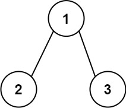
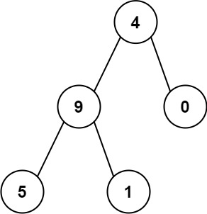

# 129. Sum Root to Leaf Numbers


You are given the `root` of a binary tree containing digits from `0` to `9` only.

Each root-to-leaf path in the tree represents a number.

For example, the root-to-leaf path `1 -> 2 -> 3` represents the number `123`.
Return the total sum of all root-to-leaf numbers. Test cases are generated so that the answer will fit in a **32-bit** integer.

A **leaf** node is a node with no children.

 

**Example 1:**


```
Input: root = [1,2,3]
Output: 25
Explanation:
The root-to-leaf path 1->2 represents the number 12.
The root-to-leaf path 1->3 represents the number 13.
Therefore, sum = 12 + 13 = 25.
```
**Example 2:**

```
Input: root = [4,9,0,5,1]
Output: 1026
Explanation:
The root-to-leaf path 4->9->5 represents the number 495.
The root-to-leaf path 4->9->1 represents the number 491.
The root-to-leaf path 4->0 represents the number 40.
Therefore, sum = 495 + 491 + 40 = 1026.
```
 

**Constraints:**

* The number of nodes in the tree is in the range `[1, 1000]`.
* `0 <= Node.val <= 9`
* The depth of the tree will not exceed `10`.

## Solution
```python
# Definition for a binary tree node.
# class TreeNode:
#     def __init__(self, val=0, left=None, right=None):
#         self.val = val
#         self.left = left
#         self.right = right
class Solution:
    def sumNumbers(self, root: Optional[TreeNode]) -> int:
        # DFS, recursion, 
        # when there's path of tree, path is always outside global variable
        # result used to save each path when recursion ends
        res = list()
        path = list()
        def traverse(root, path):
            # termination condition
            if not root:
                return
            # leaf node found, save current path to result
            if not root.left and not root.right:
                res.append(path)
            # traverse the left side, add current val to path and go deeper
            if root.left:
                traverse(root.left, path + [root.left.val])
            # traverse the right side, add current val to path and go deeper
            if root.right:
                traverse(root.right, path + [root.right.val])
            # when both side completed, simply goes back and returns nothing
        # start from root node
        traverse(root, [root.val])
        # calculate sum using decimal calculation
        # [[4, 9, 5], [4, 9, 1], [4, 0]]
        total = 0        # sum of total path
        for path in res:
            cur = 0      # sum of current path
            for num in path:
                cur = cur * 10 + num    # multiply 10 each time
            total += cur        # add sum of current path to total
        return total
```
