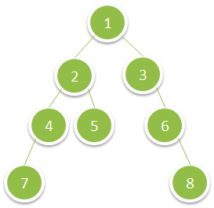

# 1302. Deepest Leaves Sum


Given the `root` of a binary tree, return *the sum of values of its deepest leaves*.

**Example 1:**



>**Input:** `root = [1,2,3,4,5,null,6,7,null,null,null,null,8]`  
**Output:** `15`

**Example 2:**

>**Input:** `root = [6,7,8,2,7,1,3,9,null,1,4,null,null,null,5]`  
**Output:** `19`
 

**Constraints:**

* The number of nodes in the tree is in the range `[1, 104]`.
* `1 <= Node.val <= 100`

## Solution
```python
# Definition for a binary tree node.
# class TreeNode:
#     def __init__(self, val=0, left=None, right=None):
#         self.val = val
#         self.left = left
#         self.right = right
class Solution:
    def deepestLeavesSum(self, root: Optional[TreeNode]) -> int:
        """BFS, level traversal"""
        dq = collections.deque([root])
        while dq:
            level = list()
            for _ in range(len(dq)):
                cur = dq.popleft()
                level.append(cur.val)
                if cur.left:
                    dq.append(cur.left)
                if cur.right:
                    dq.append(cur.right)
        return sum(level)
```
