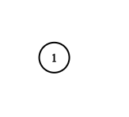

# 133. Clone Graph


Given a reference of a node in a **connected** undirected graph.

Return a **deep copy** (clone) of the graph.

Each node in the graph contains a value (`int`) and a list (`List[Node]`) of its neighbors.

>class Node {  
    public int val;  
    public List<Node> neighbors;  
}  
 

**Test case format:**

For simplicity, each node's value is the same as the node's index (1-indexed). For example, the first node with `val == 1`, the second node with `val == 2`, and so on. The graph is represented in the test case using an adjacency list.

An adjacency list is a collection of unordered lists used to represent a finite graph. Each list describes the set of neighbors of a node in the graph.

The given node will always be the first node with `val = 1`. You must return the copy of the given node as a reference to the cloned graph.


**Example 1:**


>Input: adjList = [[2,4],[1,3],[2,4],[1,3]]  
Output: [[2,4],[1,3],[2,4],[1,3]]  
Explanation: There are 4 nodes in the graph.  
1st node (val = 1)'s neighbors are 2nd node (val = 2) and 4th node (val = 4).  
2nd node (val = 2)'s neighbors are 1st node (val = 1) and 3rd node (val = 3).  
3rd node (val = 3)'s neighbors are 2nd node (val = 2) and 4th node (val = 4).  
4th node (val = 4)'s neighbors are 1st node (val = 1) and 3rd node (val = 3).  

**Example 2:**



>Input: adjList = [[]]  
Output: [[]]  
Explanation: Note that the input contains one empty list. The graph consists of only one node with val = 1 and it does not have any neighbors.  


**Example 3:**

>Input: adjList = []  
Output: []  
Explanation: This an empty graph, it does not have any nodes.  
 

**Constraints:**

* The number of nodes in the graph is in the range `[0, 100]`.
* `1 <= Node.val <= 100`
* `Node.val` is unique for each node.
* There are no repeated edges and no self-loops in the graph.
* The Graph is connected and all nodes can be visited starting from the given node.

# Hash Table {origin: clone}

```python
"""
# Definition for a Node.
class Node:
    def __init__(self, val = 0, neighbors = None):
        self.val = val
        self.neighbors = neighbors if neighbors is not None else []
"""

from typing import Optional
class Solution:
    def __init__(self):
        # KEY: {origin: clone} 
        self.visited = {}

    def cloneGraph(self, node: Optional['Node']) -> Optional['Node']:
        if not node:
            return
        # KEY: if visited, return corresponding clone node, no need to go deeper
        if node in self.visited:
            return self.visited[node]
        # create clone and add to corresponding visited origin
        clone =  Node(node.val)
        self.visited[node] = clone

        for child in node.neighbors:
            clone.neighbors.append(self.cloneGraph(child))

        return clone
```
