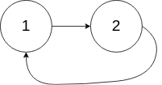

# 142. Linked List Cycle II


Given the `head` of a linked list, return *the node where the cycle begins. If there is no cycle, return `null`*.

There is a cycle in a linked list if there is some node in the list that can be reached again by continuously following the `next` pointer. Internally, `pos` is used to denote the index of the node that tail's `next` pointer is connected to **(0-indexed)**. It is `-1` if there is no cycle. **Note that `pos` is not passed as a parameter**.

**Do not modify** the linked list.

 

**Example 1:**


>**Input:** head = [3,2,0,-4], pos = 1  
**Output:** tail connects to node index 1  
**Explanation:** There is a cycle in the linked list, where tail connects to the second node.


**Example 2:**


**Input:** head = [1,2], pos = 0
**Output:** tail connects to node index 0
**Explanation:** There is a cycle in the linked list, where tail connects to the first node.


**Example 3:**


>**Input:** head = [1], pos = -1  
**Output:** no cycle  
**Explanation:** There is no cycle in the linked list.
 

**Constraints:**

* The number of the nodes in the list is in the range `[0, 104]`.
* `-105 <= Node.val <= 105`
* `pos` is `-1` or a valid index in the linked-list.
 

Follow up: Can you solve it using O(1) (i.e. constant) memory?

## Floyd's Cycle-Finding Algorithm

```python
# Definition for singly-linked list.
# class ListNode:
#     def __init__(self, x):
#         self.val = x
#         self.next = None

class Solution:
    def detectCycle(self, head: Optional[ListNode]) -> Optional[ListNode]:
        """
            (a)
        1---------2------
                  |      | (b)
                  |      | 
              (c) |      |
                   ------3
        (slow) walk a + b to reach point 3
        (fast) run  a + K*(b+c) + b to reach point 3
        K: number of full rounds fast has to go before he meets slow
        slow meet fast at point 3

        Within the same time, distance will be the same for: 
        2slow = fast
        2(a+b) = a + K*(b+c) + b
        a+b = K*(b+c)
        a = (K-1)*b + K*C
        Let N = K - 1
        a = N*b + (N+1)*c

        Finally, KEY of this problem:
        a = c + N*(b+c)
        slow1 from 1 to 2.
        slow2 go N full round (b+c) from 3 to 3, Then start from 3 heading to 2
        the node slow1 and slow2 meet is the answer
        """
        slow = fast = head
        while fast and fast.next:
            slow = slow.next
            fast = fast.next.next
            # slow and fast meet at point 3
            if slow == fast:
                # slow2 start to move
                slow2 = head
                while slow2 != slow:
                    slow2 = slow2.next
                    slow = slow.next
                # two slow walkers meet at beginning of the cirle
                return slow2
        return None
```
