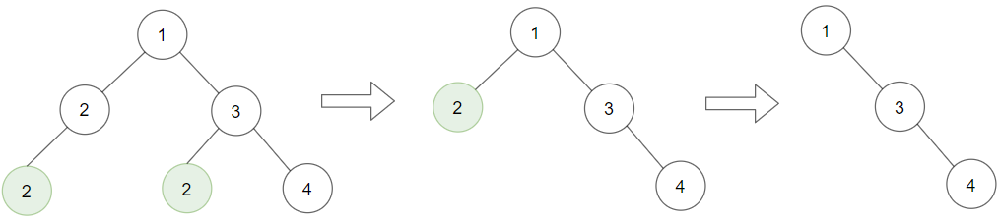
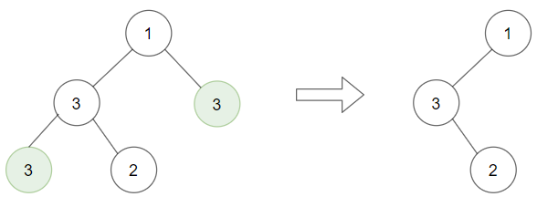
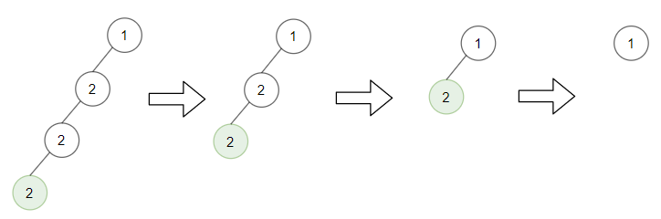

# 1325. Delete Leaves With a Given Value

Given a binary tree `root` and an integer `target`, delete all the **leaf nodes** with value `target`.

Note that once you delete a leaf node with value `target`, if its parent node becomes a leaf node and has the value `target`, it should also be deleted (you need to continue doing that until you cannot).


**Example 1:**



>Input: root = [1,2,3,2,null,2,4], target = 2  
Output: [1,null,3,null,4]  
Explanation: Leaf nodes in green with value (target = 2) are removed (Picture in left).   
After removing, new nodes become leaf nodes with value (target = 2) (Picture in center).  


**Example 2:**



>Input: root = [1,3,3,3,2], target = 3  
Output: [1,3,null,null,2]  

**Example 3:**



>Input: root = [1,2,null,2,null,2], target = 2    
Output: [1]  
Explanation: Leaf nodes in green with value (target = 2) are removed at each step.  
 

**Constraints:**

* The number of nodes in the tree is in the range `[1, 3000]`.
* `1 <= Node.val, target <= 1000`


## Pattern
1. When condition matches, what you return to the CALLER?
2. If we keep going deeper, how to handle the return value from the RECURSIVE CALL?


## Binary Tree

```python
# Definition for a binary tree node.
# class TreeNode:
#     def __init__(self, val=0, left=None, right=None):
#         self.val = val
#         self.left = left
#         self.right = right
class Solution:
    def removeLeafNodes(self, root: Optional[TreeNode], target: int) -> Optional[TreeNode]:
        # no leaves equals target
        if not root:
            return
        if not root.left and not root.right and root.val == target:
            return
        root.left = self.removeLeafNodes(root.left, target)
        root.right = self.removeLeafNodes(root.right, target)
        
        return None if not root.left and not root.right and root.val == target else root
```
