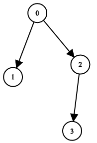
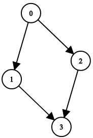
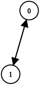

# 1361. Validate Binary Tree Nodes


You have n binary tree nodes numbered from `0` to `n - 1` where node i has two children `leftChild[i]` and rightChild[i], return `true` if and only if **all** the given nodes form exactly one valid binary tree.

If node i has no left child then `leftChild[i]` will equal `-1`, similarly for the right child.

Note that the nodes have no values and that we only use the node numbers in this problem.


**Example 1:**



>Input: n = 4, leftChild = [1,-1,3,-1], rightChild = [2,-1,-1,-1]  
Output: true  

**Example 2:**



>Input: n = 4, leftChild = [1,-1,3,-1], rightChild = [2,3,-1,-1]  
Output: false  


**Example 3:**



>Input: n = 2, leftChild = [1,0], rightChild = [-1,-1]  
Output: false  
 

**Constraints:**

* `n == leftChild.length == rightChild.length`
* `1 <= n <= 104`
* `-1 <= leftChild[i], rightChild[i] <= n - 1`

## Binary Tree Definition + DFS (Java)

```java
class Solution {
    public boolean validateBinaryTreeNodes(int n, int[] leftChild, int[] rightChild) {
        // get root to start traversal
        int root = findRoot(n, leftChild, rightChild);
        if (root == -1){
            return false;
        }

        // RULE 2: No cycles in a tree, traverse each node, if node has been seen before, cycle exists
        HashSet<Integer> seen = new HashSet<>();
        seen.add(root);     // root is the first node we seen
        Stack<Integer> stack = new Stack<>();
        stack.push(root);   // start from root

        while (!stack.isEmpty()){
            int node = stack.pop();
            // get children for current node
            int[] children = {leftChild[node], rightChild[node]};
 
            
            for (int child : children){
                // chlid not exist, continue
                if (child == -1){
                    continue;
                }
                // child seen before, cycle exist
                if (seen.contains(child)){
                    return false;
                }
                // add them into stack and seen for next round
                stack.push(child);
                seen.add(child);
            }
        }
        // RULE 3: All nodes must be reachable from root, so #traversal == #children
        return seen.size() == n;
    }

    private int findRoot(int n, int[] leftChild, int[] rightChild){
        // RULE 1: a tree must have exactly one root, find it as the beginning of traverse
        HashSet<Integer> children = new HashSet<>();
        
        for (int left: leftChild){
            children.add(left);
        }
        for (int right: rightChild){
            children.add(right);
        }
        // if node is found in children, it must has a parent, so it's not a root
        for (int node = 0; node < n; node++) {
            if (!children.contains(node)){
                return node;
            }
        }
        return -1;
    }
}
```


## Binary Tree Definition + DFS (Python)
```python
class Solution:
    def validateBinaryTreeNodes(self, n: int, leftChild: List[int], rightChild: List[int]) -> bool:
        # KEY: index and value of the list are all nodes, treat them as the same thing
        # RULE 1: a tree must have exactly 1 root node
        def find_root(n, leftChild, rightChild):    
            # set operation AND to get all children, the root must not be in the children
            children = set(leftChild) | set(rightChild)
            # if the node_val in the children, it must have parent, so it is not root
            for node_val in range(n):
                if node_val not in children:
                    return node_val
            return -1
        
        root = find_root(n, leftChild, rightChild)
        if root == -1:
            return False
  
        seen = set()
        seen.add(root)  # root is the first node we seen
        stack = [root]
        while stack:
            node = stack.pop()
            # check left and right children for current node
            for child in [leftChild[node], rightChild[node]]:
                # RULE 2: No cycle: if node has been seen before, there's a cycle
                # filter -1, no children
                if child == -1:
                    continue
                if child in seen:
                    return False
                seen.add(child)
                stack.append(child)

        # RULE 3: all nodes should be reachable from root, no disconnection
        # traverse to count if #reachable nodes == #length of child
        return len(seen) == n
```
