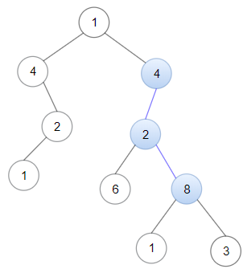
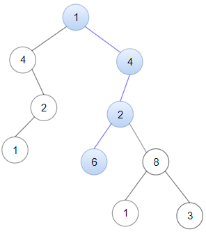

# 1367. Linked List in Binary Tree

Given a binary tree `root` and a linked list with `head` as the first node. 

Return True if all the elements in the linked list starting from the `head` correspond to some *downward path* connected in the binary tree otherwise return False.

In this context downward path means a path that starts at some node and goes downwards.

 

**Example 1:**



>**Input:** `head = [4,2,8], root = [1,4,4,null,2,2,null,1,null,6,8,null,null,null,null,1,3]`  
**Output:** `true`  
**Explanation:** Nodes in blue form a subpath in the binary Tree.  


**Example 2:**



>**Input:** `head = [1,4,2,6], root = [1,4,4,null,2,2,null,1,null,6,8,null,null,null,null,1,3]`    
**Output:** `true`

**Example 3:**

>**Input:** `head = [1,4,2,6,8], root = [1,4,4,null,2,2,null,1,null,6,8,null,null,null,null,1,3]`
**Output:** `false`
**Explanation:** There is no path in the binary tree that contains all the elements of the linked list from head.
 

**Constraints:**

* The number of nodes in the tree will be in the range `[1, 2500]`.
* The number of nodes in the list will be in the range `[1, 100]`.
* `1 <= Node.val <= 100` for each node in the linked list and binary tree.

## Solution

```python
# Definition for singly-linked list.
# class ListNode:
#     def __init__(self, val=0, next=None):
#         self.val = val
#         self.next = next
# Definition for a binary tree node.
# class TreeNode:
#     def __init__(self, val=0, left=None, right=None):
#         self.val = val
#         self.left = left
#         self.right = right
class Solution:
    def isSubPath(self, head: Optional[ListNode], root: Optional[TreeNode]) -> bool:
        """DFS for comparison + BFS for path"""
        def isEqual(head, root):
            # all node's in LInkedList are equal
            if not head: return True
            # return False if path is shorter or the node does not match
            if not root or head.val != root.val: return False
            # keep checking each side of the tree, either side finds the equal path is ok
            return isEqual(head.next, root.left) or isEqual(head.next, root.right)
            

        # level traverse for subpath
        dq = collections.deque([root])
        while dq:
            for _ in range(len(dq)):
                cur = dq.popleft()
                # first equal node found, check if subpath start from [current] is equal
                if head.val == cur.val and isEqual(head, cur):
                    return True
                if cur.left:
                    dq.append(cur.left)
                if cur.right:
                    dq.append(cur.right)
        return False
```
