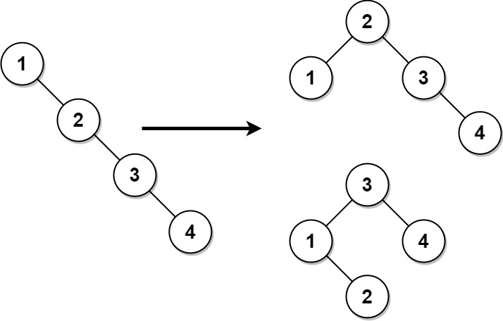
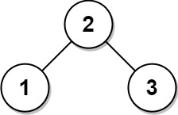

# 1382. Balance a Binary Search Tree

Given the `root` of a binary search tree, return *a **balanced** binary search tree with the same node values*. If there is more than one answer, return **any of them**.

A binary search tree is balanced if the depth of the two subtrees of every node never differs by more than `1`.

 

**Example 1:**




>**Input**: root = [1,null,2,null,3,null,4,null,null]  
**Output**: [2,1,3,null,null,null,4]  
**Explanation**: This is not the only correct answer, [3,1,4,null,2] is also correct.  

**Example 2:**



>**Input**: root = [2,1,3]  
**Output**: [2,1,3]  
 

**Constraints:**

* The number of nodes in the tree is in the range `[1, 104]`.
* `1 <= Node.val <= 105`


## DFS Recursion

```python
# Definition for a binary tree node.
# class TreeNode:
#     def __init__(self, val=0, left=None, right=None):
#         self.val = val
#         self.left = left
#         self.right = right
class Solution:
    def balanceBST(self, root: TreeNode) -> TreeNode:
        # BST
        # Approach 1: DFS
        # inorder traversal -> sorted list
        sorted_ls = []
        def inorder(root):
            if not root:
                return
            inorder(root.left)
            sorted_ls.append(root)
            inorder(root.right)
        # create new BST from sorted list: divide and conquer
        def build(ls):
            if len(ls) <= 0:
                return 
            mid = len(ls) // 2
            root = ls[mid]
            root.left = build(ls[:mid])
            root.right = build(ls[mid+1:])
            return root
        inorder(root)
        ans = build(sorted_ls)
        return ans
```


## Stack Iteration

```python
# Definition for a binary tree node.
# class TreeNode:
#     def __init__(self, val=0, left=None, right=None):
#         self.val = val
#         self.left = left
#         self.right = right
class Solution:
    def balanceBST(self, root: TreeNode) -> TreeNode:
        # BST
        # Approach 2: Stack Iteration 
        # inorder traversal
        sorted_ls = []
        def inorder(root):
            stack = []
            while stack or root:
                # keep going left
                if root:
                    stack.append(root)
                    root = root.left
                else:
                    root = stack.pop()
                    sorted_ls.append(root)
                    root = root.right

        # create new BST from sorted list: divide and conquer
        def build(ls):
            if len(ls) <= 0:
                return 
            mid = len(ls) // 2
            root = ls[mid]
            root.left = build(ls[:mid])
            root.right = build(ls[mid+1:])
            return root
        inorder(root)
        ans = build(sorted_ls)
        return ans
```
