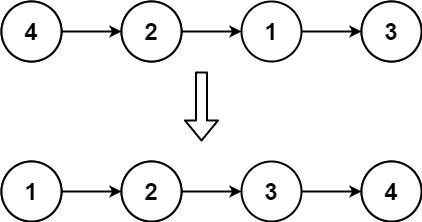
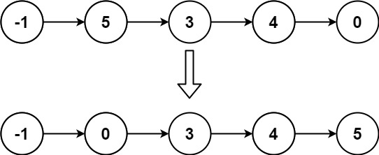

# 147. Insertion Sort List


Given the `head` of a singly linked list, sort the list using **insertion sort**, and return *the sorted list's head*.

The steps of the **insertion sort** algorithm:

1. Insertion sort iterates, consuming one input element each repetition and growing a sorted output list.
2. At each iteration, insertion sort removes one element from the input data, finds the location it belongs within the sorted list and inserts it there.
3. It repeats until no input elements remain.
The following is a graphical example of the insertion sort algorithm. The partially sorted list (black) initially contains only the first element in the list. One element (red) is removed from the input data and inserted in-place into the sorted list with each iteration.


 

**Example 1:**



>**Input**: head = [4,2,1,3]  
**Output**: [1,2,3,4]  


**Example 2:**



>**Input**: head = [-1,5,3,4,0]  
**Output**: [-1,0,3,4,5]  
 

**Constraints:**

* The number of nodes in the list is in the range `[1, 5000]`.
* `-5000 <= Node.val <= 5000`


```python
# Definition for singly-linked list.
# class ListNode:
#     def __init__(self, val=0, next=None):
#         self.val = val
#         self.next = next
class Solution:
    def insertionSortList(self, head: Optional[ListNode]) -> Optional[ListNode]:
        # insertion sort with linkedlist
        # find the INSERTION SPOT, which is a spot before the first spot bigger than cur.val
        # KEY: dummy is an empty new LinkedList for insertion
        # KEY: cur is on original list, prev is on new list
        dummy = ListNode()
        curr = head

        while curr:
            # at each iteration, we insert an element into the resulting list
            prev = dummy

            # find the position to insert the cur node
            while prev.next and prev.next.val <= curr.val:
                prev = prev.next
            
            # prev.next.val > curr.val, prev.next is INSERTION SPOT
            # nxt will be the start of next iteration, save it first
            nxt = curr.next
            
            # insert cur node to the insertion spot
            curr.next = prev.next
            prev.next = curr

            # move to next iteration
            curr = nxt
        return dummy.next
```