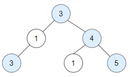

# 1448. Count Good Nodes in Binary Tree

Given a binary tree `root`, a node X in the tree is named good if in the path from root to X there are no nodes with a value *greater than X*.

Return the number of **good** nodes in the binary tree.

 

**Example 1:**



>**Input:** root = [3,1,4,3,null,1,5]  
**Output:** 4  
**Explanation:** Nodes in blue are **good**.  
Root Node (3) is always a good node.
Node 4 -> (3,4) is the maximum value in the path starting from the root.  
Node 5 -> (3,4,5) is the maximum value in the path.  
Node 3 -> (3,1,3) is the maximum value in the path.


**Example 2:**


>**Input:** root = [3,3,null,4,2]  
**Output:** 3  
**Explanation:** Node 2 -> (3, 3, 2) is not good, because "3" is higher than it.  


**Example 3:**

>**Input:** root = [1]  
**Output:** 1  
**Explanation:** Root is considered as good.  
 

**Constraints:**

* The number of nodes in the binary tree is in the range `[1, 10^5]`.
* Each node's value is between `[-10^4, 10^4]`.


## Solution

```python
# Definition for a binary tree node.
# class TreeNode:
#     def __init__(self, val=0, left=None, right=None):
#         self.val = val
#         self.left = left
#         self.right = right
class Solution:
    def goodNodes(self, root: TreeNode) -> int:
        """DFS, Path, only compare max element in the path"""
        maxv = root.val
        # use mutable object for in function access
        good = [0]
        def traverse(root, maxv):
            if not root: return
            # only need to compare 2 value
            if root.val >= maxv:
               good[0] += 1 
            # keep updating the max value of previous path
            traverse(root.left, max(maxv, root.val))
            traverse(root.right, max(maxv, root.val))
            
        traverse(root, maxv)
        return  good[0]
```

## Solution2
```python
# Definition for a binary tree node.
# class TreeNode:
#     def __init__(self, val=0, left=None, right=None):
#         self.val = val
#         self.left = left
#         self.right = right
class Solution:
    def goodNodes(self, root: TreeNode) -> int:
        """pure DFS, much faster"""
        def dfs(node, prev_val):
            if not node:
                return 0
            elif node.val >= prev_val:
                return 1 + dfs(node.left, node.val) + dfs(node.right, node.val)
            else:
                return dfs(node.left, prev_val) + dfs(node.right, prev_val)

        return dfs(root, root.val)
```