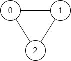

# 1971. Find if Path Exists in Graph


There is a **bi-directional** graph with `n` vertices, where each vertex is labeled from `0` to `n - 1` (**inclusive**). The edges in the graph are represented as a 2D integer array `edges`, where each `edges[i] = [ui, vi]` denotes a bi-directional edge between vertex `ui` and vertex `vi`. Every vertex pair is connected by **at most one** edge, and no vertex has an edge to itself.

You want to determine if there is a **valid path** that exists from vertex `source` to vertex `destination`.

Given `edges` and the integers `n`, `source`, and `destination`, return *`true` if there is a **valid path** from `source` to `destination`, or `false` otherwise.*

 

**Example 1:**



>Input: n = 3, edges = [[0,1],[1,2],[2,0]], source = 0, destination = 2  
Output: true  
Explanation: There are two paths from vertex 0 to vertex 2:  
>- 0 → 1 → 2  
>- 0 → 2  


**Example 2:**


>Input: n = 6, edges = [[0,1],[0,2],[3,5],[5,4],[4,3]], source = 0, destination = 5  
Output: false  
Explanation: There is no path from vertex 0 to vertex 5.  
 

**Constraints:**

* `1 <= n <= 2 * 105`
* `0 <= edges.length <= 2 * 105`
* `edges[i].length == 2`
* `0 <= ui, vi <= n - 1`
* `ui != vi`
* `0 <= source, destination <= n - 1`
* There are no duplicate edges.
* There are no self edges.


## DFS: Iterative
```python
class Solution:
    def validPath(self, n: int, edges: List[List[int]], source: int, destination: int) -> bool:
        # DFS: Iterative
        stack = [source]
        # KEY: index is corresponding to vertices O(1) for checking
        visited = [False] * n
        # save all connections in to hashtable for O(1) access, one node can have multiple edges
        graph = collections.defaultdict(list)
        for a, b in edges:
            graph[a].append(b)
            graph[b].append(a)

        while stack:
            cur = stack.pop()
            # mark as visited
            visited[cur] = True
            # path found
            if cur == destination:
                return True
            # add all unvisited children into stack
            for nxt in graph[cur]:
                if not visited[nxt]:
                    stack.append(nxt)
        return False
```

## DFS: Recursive
```python
class Solution:
    def validPath(self, n: int, edges: List[List[int]], source: int, destination: int) -> bool:
        # DFS: Recursive
        graph = collections.defaultdict(list)
        for a, b in edges:
            graph[a].append(b)
            graph[b].append(a)
        # index corresponding to vertices, default unvisited for each vertices
        visited = [False] * n

        def dfs(curr):
            # Base Case: target found
            if curr == destination:
                return True
            # set current vertices to visited
            visited[curr] = True
            # call on all unvisted children
            for nxt in graph[curr]:
                if not visited[nxt]:
                    # return once target found
                    if dfs(nxt):
                        return True
            return False
        return dfs(source)
```
