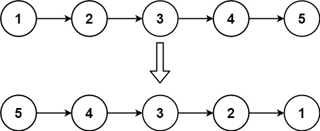

# 206. Reverse Linked List

Given the `head` of a singly linked list, reverse the list, and return *the reversed list*.

**Example 1:**



>**Input**: head = [1,2,3,4,5]  
**Output**: [5,4,3,2,1]  


**Example 2:**


>**Input**: head = [1,2]  
**Output**: [2,1]  


**Example 3:**

>**Input**: head = []  
**Output**: []  
 

**Constraints:**

* The number of nodes in the list is the range `[0, 5000]`.
* `-5000 <= Node.val <= 5000`
 

**Follow up**: A linked list can be reversed either iteratively or recursively. Could you implement both?


## In Place
```python
# Definition for singly-linked list.
# class ListNode:
#     def __init__(self, val=0, next=None):
#         self.val = val
#         self.next = next
class Solution:
    def reverseList(self, head: Optional[ListNode]) -> Optional[ListNode]:
        if not head: return None
        prev, cur = None, head
        while cur:
            nxt = cur.next
            cur.next = prev
            prev = cur
            cur = nxt
        return prev
```


## Recursion

Base Case: head is None, pre is the new head
Recursive Relation: pointing head to pre, update current head = head.next, pre = current head

```python
# Definition for singly-linked list.
# class ListNode:
#     def __init__(self, val=0, next=None):
#         self.val = val
#         self.next = next
class Solution:
    def reverseList(self, head: Optional[ListNode]) -> Optional[ListNode]:
        # Recursion
        def reverse(head, pre):
            # last pre is the new head of the list
            if not head:
                return pre
            # recurrsive relation: 
            # pointing head to pre
            nxt = head.next
            head.next = pre
            # update next as head and current head as pre
            return reverse(nxt, head)
        return reverse(head, None)
```