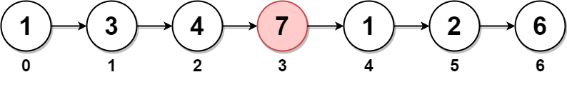

# 2095. Delete the Middle Node of a Linked List

You are given the `head` of a linked list. Delete the middle node, and return the `head` of the modified linked list.

The middle node of a linked list of size `n` is the `⌊n / 2⌋th` node from the start using 0-based indexing, where `⌊x⌋` denotes the largest integer less than or equal to `x`.

For `n` = `1`, `2`, `3`, `4`, and `5`, the middle nodes are `0`, `1`, `1`, `2`, and `2`, respectively.
 

**Example 1:**



Input: head = [1,3,4,7,1,2,6]
Output: [1,3,4,1,2,6]
Explanation:
The above figure represents the given linked list. The indices of the nodes are written below.
Since n = 7, node 3 with value 7 is the middle node, which is marked in red.
We return the new list after removing this node. 
**Example 2:**


Input: head = [1,2,3,4]
Output: [1,2,4]
Explanation:
The above figure represents the given linked list.
For n = 4, node 2 with value 3 is the middle node, which is marked in red.
**Example 3:**


Input: head = [2,1]
Output: [2]
Explanation:
The above figure represents the given linked list.
For n = 2, node 1 with value 1 is the middle node, which is marked in red.
Node 0 with value 2 is the only node remaining after removing node 1.
 

**Constraints:**

* `The number of nodes in the list is in the range [1, 105].`
* `1 <= Node.val <= 105`

## Solution
```python
# Definition for singly-linked list.
# class ListNode:
#     def __init__(self, val=0, next=None):
#         self.val = val
#         self.next = next
class Solution:
    def deleteMiddle(self, head: Optional[ListNode]) -> Optional[ListNode]:
        # in order to delete the middle node, we need the previous node
        # fast and slow pointer to find the middle node
        if not head.next: return None
        slow = fast = head
        while fast and fast.next:
            # current slow is prev node before middle node
            prev = slow     
            slow = slow.next
            fast = fast.next.next
        prev.next = slow.next
        slow.next = None    # disconnect
        return head
```
