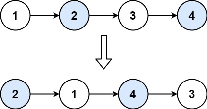

# 24. Swap Nodes in Pairs

Given a linked list, swap every two adjacent nodes and return its head. You must solve the problem without modifying the values in the list's nodes (i.e., only nodes themselves may be changed.)

 

**Example 1:**



>**Input**: head = [1,2,3,4]  
**Output**: [2,1,4,3]  


**Example 2:**

>**Input**: head = []  
**Output**: []  

**Example 3:**

>**Input**: head = [1]  
**Output**: [1]  
 

**Constraints:**

* The number of nodes in the list is in the range `[0, 100]`.
* `0 <= Node.val <= 100`


## In Place
```python
# Definition for singly-linked list.
# class ListNode:
#     def __init__(self, val=0, next=None):
#         self.val = val
#         self.next = next
class Solution:
    def swapPairs(self, head: Optional[ListNode]) -> Optional[ListNode]:
        if not head: return None
        prev, cur, res = None, head, head.next
        while cur and cur.next:
            # switch two nodes
            nxt = cur.next
            # if there's a prev node, connect it to the new re-ordered node first
            if prev:
                prev.next = nxt
            cur.next = nxt.next
            nxt.next = cur
            # KEY: use prev to store previous cur node
            prev = cur
            # move cur to first node of the next pair
            cur = cur.next
        # because head might switch place with head.next, either of them could be ans
        return res or head
```


## Recursion

```python
# Definition for singly-linked list.
# class ListNode:
#     def __init__(self, val=0, next=None):
#         self.val = val
#         self.next = next
class Solution:
    def swapPairs(self, head: Optional[ListNode]) -> Optional[ListNode]:
        # Recursion
        def swap(head):
            if not head or not head.next:
                return head
            first, second = head, head.next
            # return the second node as new head to reconnect
            first.next = swap(second.next)
            second.next = first
            # second is the new head for each recursion LinkedList
            return second
        return swap(head)
```
