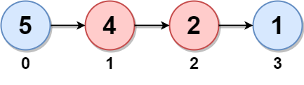
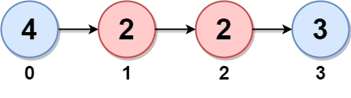
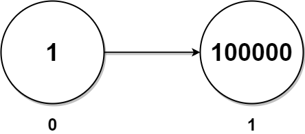

# 2130. Maximum Twin Sum of a Linked List


In a linked list of size `n`, where `n` is even, the ith node **(0-indexed)** of the linked list is known as the twin of the `(n-1-i)^th` node, if `0 <= i <= (n / 2) - 1`.

For example, if `n = 4`, then node `0` is the twin of node `3`, and node `1` is the twin of node `2`. These are the only nodes with twins for `n = 4`.
The twin sum is defined as the sum of a node and its twin.

Given the head of a linked list with even length, return the maximum twin sum of the linked list.


**Example 1:**


Input: `head = [5,4,2,1]`
Output: `6`
**Explanation:**
```
Nodes 0 and 1 are the twins of nodes 3 and 2, respectively. All have twin sum = 6.
There are no other nodes with twins in the linked list.
Thus, the maximum twin sum of the linked list is 6.
```

**Example 2:**


**Input:** head = [4,2,2,3]
**Output:** 7
**Explanation:**
```
The nodes with twins present in this linked list are:
- Node 0 is the twin of node 3 having a twin sum of 4 + 3 = 7.
- Node 1 is the twin of node 2 having a twin sum of 2 + 2 = 4.
Thus, the maximum twin sum of the linked list is max(7, 4) = 7.
```

**Example 3:**



```
Input: head = [1,100000]
Output: 100001
Explanation:
There is only one node with a twin in the linked list having twin sum of 1 + 100000 = 100001.
```

**Constraints:**

* The number of nodes in the list is an even integer in the range `[2, 105]`.
* `1 <= Node.val <= 105`


## Solution
```python
# Definition for singly-linked list.
# class ListNode:
#     def __init__(self, val=0, next=None):
#         self.val = val
#         self.next = next
class Solution:
    def pairSum(self, head: Optional[ListNode]) -> int:
        """pure in-place node movement, no need for extra space"""
        # slow fast pointer to find the middle point since length is even
        slow = fast = head
        while fast and fast.next:
            slow = slow.next
            fast = fast.next.next
        # slow will be first node of the other half, reverse from here
        prev = None
        while slow:
            nxt = slow.next
            slow.next = prev
            prev = slow
            slow = nxt
 
        # prev is now the head of the reversed list 
        # traverse together with original head
        max_ = 0
        # no need to cut original left part, since we use prev to traverse
        while prev:
            max_ = max(prev.val + head.val, max_)
            prev = prev.next
            head = head.next
        return max_
```
