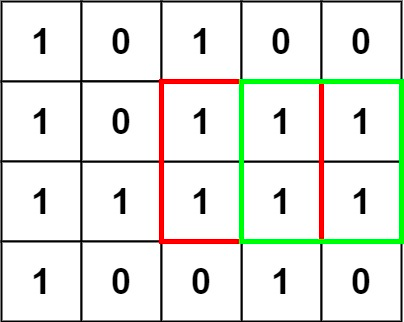
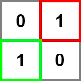

# 221. Maximal Square


Given an `m x n` binary matrix filled with `0`'s and `1`'s, find *the largest square containing only `1`'s and return its area*.


**Example 1:**



>**Input**: matrix = [["1","0","1","0","0"],["1","0","1","1","1"],["1","1","1","1","1"],["1","0","0","1","0"]]  
**Output**: 4


**Example 2:**



>**Input**: matrix = [["0","1"],["1","0"]]  
**Output**: 1


**Example 3:**

>**Input**: matrix = [["0"]]  
**Output**: 0
 

**Constraints:**

* `m == matrix.length`
* `n == matrix[i].length`
* `1 <= m, n <= 300`
* `matrix[i][j]` is `'0'` or `'1'`.


## 2D-DP-Bottom Up: Iteration + 2D Array

1. **State**
    * dp[row][col]: bottom right cell of the maximal square we can get
    * only check cell 1, skip 0
2. **Recursion Relation**
    * y y   current state is at cell x  
      y x   maximal square derived from minimal y  
      `dp[row][col] = min(dp[row-1][col], dp[row-1][col-1], dp[row][col-1]) + 1`
3. **Base Case**
    * row col should stay in bounds as usually do in matrix

```python
class Solution:
    def maximalSquare(self, matrix: List[List[str]]) -> int:
        # Bottom Up: Iteration + 2D Array
        if not matrix or len(matrix) < 1:
            return 0
        # extra row and col for dp grid storage
        # 0 0 0 0
        # 0 x x x
        # 0 x x x
        # 0 x x x
        rows, cols = len(matrix), len(matrix[0])
        dp = [[0] * (cols+1) for _ in range(rows+1)]
        
        mx_side = 0
        for row in range(rows):
            for col in range(cols):
                # only handle cells with "1"
                if matrix[row][col] == "1":
                    # be careful of the extra row and col calculation
                    dp[row+1][col+1] = min(dp[row+1][col], dp[row][col], dp[row][col+1]) + 1
                    # update max side
                    mx_side = max(mx_side, dp[row+1][col+1])
        
        return mx_side**2
```
