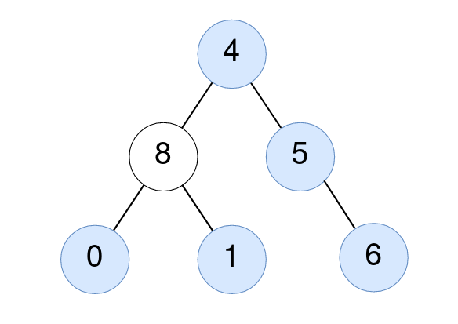

# 2265. Count Nodes Equal to Average of Subtree

Given the `root` of a binary tree, return *the number of nodes where the value of the node is equal to the **average** of the values in its **subtree**.*

Note:

* The **average** of `n` elements is the **sum** of the `n` elements divided by `n` and **rounded down** to the nearest integer.
* A **subtree** of `root` is a tree consisting of `root` and all of its descendants.
 

**Example 1:**



>**Input**: root = [4,8,5,0,1,null,6]  
**Output**: 5  
**Explanation**:   
For the node with value 4: The average of its subtree is (4 + 8 + 5 + 0 + 1 + 6) / 6 = 24 / 6 = 4.  
For the node with value 5: The average of its subtree is (5 + 6) / 2 = 11 / 2 = 5.  
For the node with value 0: The average of its subtree is 0 / 1 = 0.  
For the node with value 1: The average of its subtree is 1 / 1 = 1.  
For the node with value 6: The average of its subtree is 6 / 1 = 6.  


**Example 2:**


>**Input**: root = [1]  
**Output**: 1  
**Explanation**: For the node with value 1: The average of its subtree is 1 / 1 = 1.  
 

**Constraints:**

* The number of nodes in the tree is in the range `[1, 1000]`.
* `0 <= Node.val <= 1000`


## DFS PostOrder Traversal(Bottom Up)

```python
# Definition for a binary tree node.
# class TreeNode:
#     def __init__(self, val=0, left=None, right=None):
#         self.val = val
#         self.left = left
#         self.right = right
class Solution:
    def __init__(self):
        self.cnt = 0
    def averageOfSubtree(self, root: TreeNode) -> int:
        # DFS postorder traversal
        # KEY: BOTTOM UP
        def dfs(root):
            if not root:
                return 0, 0

            # get total for left and right subtree
            left_total, ln = dfs(root.left)
            right_total, rn = dfs(root.right)

            # calculate average for current root after return from both left and right
            subtotal, subn = left_total+right_total+root.val, ln+rn+1
            if root.val == subtotal // subn:
                self.cnt += 1
            return subtotal, subn
        dfs(root)
        return self.cnt
```
