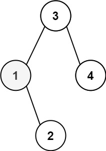

# 230. Kth Smallest Element in a BST

Given the `root` of a binary search tree, and an integer `k`, return *the `kth` smallest value (**1-indexed**) of all the values of the nodes in the tree*.


Example 1:

```
Input: root = [3,1,4,null,2], k = 1
Output: 1
```
Example 2:

```
Input: root = [5,3,6,2,4,null,null,1], k = 3
Output: 3
```

**Constraints:**

* The number of nodes in the tree is `n`.
* `1 <= k <= n <= 104`
* `0 <= Node.val <= 104`
 

**Follow up:** If the BST is modified often (i.e., we can do insert and delete operations) and you need to find the kth smallest frequently, how would you optimize?


## Stack

```python
# Definition for a binary tree node.
# class TreeNode:
#     def __init__(self, val=0, left=None, right=None):
#         self.val = val
#         self.left = left
#         self.right = right
class Solution:
    def kthSmallest(self, root: Optional[TreeNode], k: int) -> int:
        # BST, inorder traversal give us a sorted list
        stack = list()
        # if not root, right side is None, pop the next root
        while root or stack:
            # keep going left, adding all left children into stack
            while root:
                stack.append(root)
                root = root.left
            # no more left children, pop and process current root
            root = stack.pop()
            k -= 1
            # k-th smallest node found
            if k == 0:
                return root.val
            # inorder, we go to the right after processing root
            root = root.right
```

TODO: Recursion