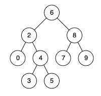

# 235. Lowest Common Ancestor of a Binary Search Tree


Given a binary search tree (BST), find the lowest common ancestor (LCA) node of two given nodes in the BST.

According to the definition of LCA on Wikipedia: “The lowest common ancestor is defined between two nodes `p` and `q` as the lowest node in `T` that has both `p` and `q` as descendants (where we allow **a node to be a descendant of itself**).”

 

**Example 1:**


>**Input:** `root = [6,2,8,0,4,7,9,null,null,3,5], p = 2, q = 8`  
**Output:** `6`  
**Explanation:** `The LCA of nodes 2 and 8 is 6.`


**Example 2:**


**Input:** `root = [6,2,8,0,4,7,9,null,null,3,5], p = 2, q = 4`  
**Output:** `2`
**Explanation:** `The LCA of nodes 2 and 4 is 2, since a node can be a descendant of itself according to the LCA definition.`


**Example 3:**

>**Input:** `root = [2,1], p = 2, q = 1`  
**Output:** `2`
 

**Constraints:**

* The number of nodes in the tree is in the range `[2, 105]`.
* `-109 <= Node.val <= 109`
* All `Node.val` are **unique**.
* `p != q`
* `p` and `q` will exist in the **BST**.


## Solution

```python
# Definition for a binary tree node.
# class TreeNode:
#     def __init__(self, x):
#         self.val = x
#         self.left = None
#         self.right = None

class Solution:
    def lowestCommonAncestor(self, root: 'TreeNode', p: 'TreeNode', q: 'TreeNode') -> 'TreeNode':
        """Use BST definition"""

        # if p and q < root, LCA on the left side, keep searching on the left tree
        if p.val < root.val and q.val < root.val:
            return self.lowestCommonAncestor(root.left, p, q)
        # if p and q > root, LCA on the right side, keep searching on the right tree
        elif p.val > root.val and q.val > root.val:
            return self.lowestCommonAncestor(root.right, p, q)
        # if p and q on opposite side, LCA is current root, this includes p or q is the root itself
        else:
            return root
```

