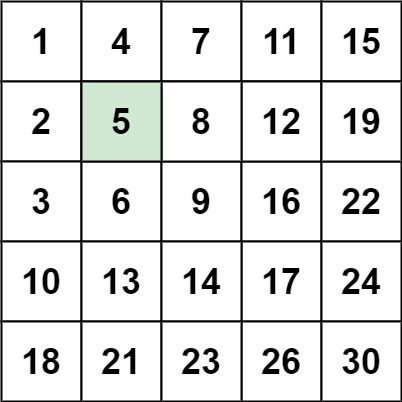

# 240. Search a 2D Matrix II

Write an efficient algorithm that searches for a value `target` in an `m x n` integer matrix `matrix`. This matrix has the following properties:

Integers in each row are sorted in ascending from left to right.
Integers in each column are sorted in ascending from top to bottom.
 

**Example 1:**



>**Input**: matrix = [[1,4,7,11,15],[2,5,8,12,19],[3,6,9,16,22],[10,13,14,17,24],[18,21,23,26,30]], target = 5  
**Output**: true  


**Example 2:**


>**Input**: matrix = [[1,4,7,11,15],[2,5,8,12,19],[3,6,9,16,22],[10,13,14,17,24],[18,21,23,26,30]], target = 20  
**Output**: false  
 

**Constraints:**

* `m == matrix.length`
* `n == matrix[i].length`
* `1 <= n, m <= 300`
* `-109 <= matrix[i][j] <= 109`
* All the integers in each row are **sorted** in ascending order.
* All the integers in each column are **sorted** in ascending order.
* `-109 <= target <= 109`

## Divide and Conquer

```python
class Solution:
    def searchMatrix(self, matrix: List[List[int]], target: int) -> bool:
        # Divide and Conquer O(NlogN), find middle point
        # 4 edges for matrix, left, up, right, down
        # Base case: 
        # 1. Empty matrix
        # 2. target > biggest or target < smallest

        if not matrix:
            return False

        def search(target, up, down, left, right):
            if left > right or up > down:
                return False
            if target < matrix[up][left] or target > matrix[down][right]:
                return False
            
            mid = left + (right - left) // 2

            # find the row that matrix[row-1][mid] < target < matrix[row][mid]
            row = up
            while row <= down and target >= matrix[row][mid]:
                if matrix[row][mid] == target:
                    return True
                row += 1
            # Divide and Conquer
            return search(target, up, row-1, mid+1, right) or search(target, row, down, left, mid-1)
        return search(target, 0, len(matrix)-1, 0, len(matrix[0])-1)
```
