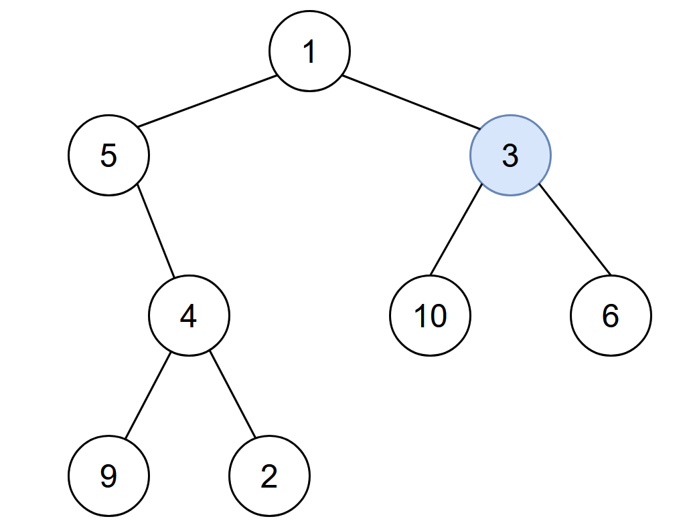
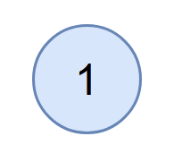

# 2385. Amount of Time for Binary Tree to Be Infected


You are given the `root` of a binary tree with **unique** values, and an integer `start`. At minute `0`, an **infection** starts from the node with value start.

Each minute, a node becomes infected if:

* The node is currently uninfected.
* The node is adjacent to an infected node.
Return *the number of minutes needed for the entire tree to be infected.*

 

**Example 1:**



>Input: root = [1,5,3,null,4,10,6,9,2], start = 3  
Output: 4  
Explanation: The following nodes are infected during:  
>- Minute 0: Node 3  
>- Minute 1: Nodes 1, 10 and 6  
>- Minute 2: Node 5  
>- Minute 3: Node 4  
>- Minute 4: Nodes 9 and 2  
>It takes 4 minutes for the whole tree to be infected so we return 4.  


**Example 2:**



>Input: root = [1], start = 1  
Output: 0  
Explanation: At minute 0, the only node in the tree is infected so we return 0. 
 

**Constraints:**

* The number of nodes in the tree is in the range `[1, 105]`.
* `1 <= Node.val <= 105`
* Each node has a unique value.
* A node with a value of start exists in the tree.

## DFS + Tree Height (Java)

```java
import static java.lang.Math.abs;
import static java.lang.Math.max;

/**
 * Definition for a binary tree node.
 * public class TreeNode {
 *     int val;
 *     TreeNode left;
 *     TreeNode right;
 *     TreeNode() {}
 *     TreeNode(int val) { this.val = val; }
 *     TreeNode(int val, TreeNode left, TreeNode right) {
 *         this.val = val;
 *         this.left = left;
 *         this.right = right;
 *     }
 * }
 */
class Solution {
    
    int maxDistance = 0;   // save furthest distance to return

    public int amountOfTime(TreeNode root, int start) {
        traverse(root, start);
        return maxDistance;
    }

    private int traverse(TreeNode root, int start){
        int currentHeight = 0;
        // empty tree has no height
        if (root == null){
            return 0;
        }
        
        // keep going left and right
        int leftHeight = traverse(root.left, start);
        int rightHeight = traverse(root.right, start);

        // target node found, 
        if (root.val == start){
            // PART I: save the tree height for later comparison
            maxDistance = Math.max(leftHeight, rightHeight);
            // set start node height to -1, meaning subtree contains target
            currentHeight = -1;
        }
        // general case, target not in subtree, return max subtree height +1
        else if (leftHeight >= 0 && rightHeight >= 0){
            return Math.max(leftHeight, rightHeight) + 1;
        }
        else {
            // PART II: Furthest node to START vs. height of subtree
            int distance = abs(leftHeight) + abs(rightHeight);
            maxDistance = Math.max(maxDistance, distance);
            // KEY: min must return the negative one, the distance from START to current root
            currentHeight = Math.min(leftHeight, rightHeight) - 1;
        }
        return currentHeight;
    }
}
```


## DFS + Tree Height (Python)
```python
# Definition for a binary tree node.
# class TreeNode:
#     def __init__(self, val=0, left=None, right=None):
#         self.val = val
#         self.left = left
#         self.right = right
class Solution:

    def __init__(self):
        self.max_distance = 0   # save for max_distance update

    def amountOfTime(self, root: Optional[TreeNode], start: int) -> int:
        # DFS, Binary Tree
        
        def traverse(root, start):
            # edge case: empty subtree, no height
            if not root:
                return 0
            # keep going left and right
            left_height = traverse(root.left, start)
            right_height = traverse(root.right, start)

            # back to current root
            # target node found
            if root.val == start:
                # PART I: save height of tree START, compare with distance later
                self.max_distance = max(left_height, right_height)
                cur_height = -1
            # general case, no negative distance, start not found in subtree
            elif left_height >= 0 and right_height >= 0:
                cur_height = max(left_height, right_height) + 1
            # negative distance found, one of the subtree contains start
            else:
                # one of them might be negative, use abs for both to get total distance
                # 2-4-5-1-3
                # PART II: compare distance of [FURTHEST node to START] and [tree START]
                distance = abs(left_height) + abs(right_height)
                self.max_distance = max(self.max_distance, distance)
                # min must return the negative height, begins at the start node
                # -1, -2, -3... distance between start and current root
                cur_height = min(left_height, right_height) - 1
            return cur_height
        traverse(root, start)
        return self.max_distance
```

## Undirected Graph + BFS (Python)

```python
# Definition for a binary tree node.
# class TreeNode:
#     def __init__(self, val=0, left=None, right=None):
#         self.val = val
#         self.left = left
#         self.right = right
class Solution:
    def amountOfTime(self, root: Optional[TreeNode], start: int) -> int:
        # DFS, transfer into Undirected Graph
        graph = collections.defaultdict(list)
        def convert(root):
            if not root:
                return
            if root.left:
                graph[root.val].append(root.left.val)
                graph[root.left.val].append(root.val)
            if root.right:
                graph[root.val].append(root.right.val)
                graph[root.right.val].append(root.val)
            convert(root.left)
            convert(root.right)
        
        convert(root)

        # traverse the undirected graph, infection, similar to matrix, level traversal
        visited = set()
        dq = collections.deque([start])
        cnt = 0
        while dq:
            # only handle the next level nodes
            for _ in range(len(dq)):
                cur = dq.popleft()
                for neighbour in graph[cur]:
                    if neighbour not in visited:
                        visited.add(cur)
                        dq.append(neighbour)
            # one level for one infection
            cnt += 1

        
        return cnt - 1
```
