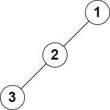

# 2583. Kth Largest Sum in a Binary Tree

You are given the root of a binary tree and a positive integer `k`.

The **level sum** in the tree is the sum of the values of the nodes that are on the **same** level.

Return the `k^th` ***largest** level sum in the tree (not necessarily distinct)*. If there are fewer than `k` levels in the tree, return `-1`.

**Note** that two nodes are on the same level if they have the same distance from the root.


**Example 1:**


```
Input: root = [5,8,9,2,1,3,7,4,6], k = 2
Output: 13
Explanation: The level sums are the following:
- Level 1: 5.
- Level 2: 8 + 9 = 17.
- Level 3: 2 + 1 + 3 + 7 = 13.
- Level 4: 4 + 6 = 10.
The 2nd largest level sum is 13.
```

**Example 2:**


```
Input: root = [1,2,null,3], k = 1
Output: 3
Explanation: The largest level sum is 3.
```

**Constraints:**

* The number of nodes in the tree is `n`.
* `2 <= n <= 105`
* `1 <= Node.val <= 106`
* `1 <= k <= n`

## Solution
```python
# Definition for a binary tree node.
# class TreeNode:
#     def __init__(self, val=0, left=None, right=None):
#         self.val = val
#         self.left = left
#         self.right = right
class Solution:
    def kthLargestLevelSum(self, root: Optional[TreeNode], k: int) -> int:
        """BFS; level traversal"""
        dq = collections.deque([root])
        cnt, sums = 0, list()
        while dq:
            level_sum = 0
            cnt += 1
            for _ in range(len(dq)):
                cur = dq.popleft()
                level_sum += cur.val
                if cur.left:
                    dq.append(cur.left)
                if cur.right:
                    dq.append(cur.right)
            # append current level sum
            sums.append(level_sum)
        return -1 if cnt < k else sorted(sums)[-k]
```
