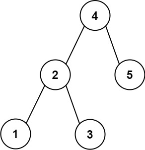

# 270. Closest Binary Search Tree Value

Given the `root` of a binary search tree and a `target` value, return *the value in the BST that is closest to the `target`*. If there are multiple answers, print the smallest.


**Example 1:**



>**Input**: root = [4,2,5,1,3], target = 3.714286  
**Output**: 4  

**Example 2:**

>**Input**: root = [1], target = 4.428571  
**Output**: 1  
 

**Constraints:**

* The number of nodes in the tree is in the range `[1, 104]`.
* `0 <= Node.val <= 109`
* `-109 <= target <= 109`


## Binary Search + BST

```python
# Definition for a binary tree node.
# class TreeNode:
#     def __init__(self, val=0, left=None, right=None):
#         self.val = val
#         self.left = left
#         self.right = right
class Solution:
    def closestValue(self, root: Optional[TreeNode], target: float) -> int:
        # Binary Search + BST
        # start from root as the closest num
        closest = root.val
        while root:
            # current diff < minimum diff or same diff, smaller num
            curDiff = abs(root.val - target)
            minDiff = abs(closest - target)
            if curDiff < minDiff or (curDiff == minDiff and root.val < closest):
                closest = root.val
            # go LEFT
            if target < root.val:
                root = root.left    
            # go RIGHT
            else:
                root = root.right
            # if target == root.val, diff == 0, no need to handle
        return closest
```
