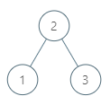

# 285. Inorder Successor in BST.md

Given the `root` of a binary search tree and a node `p` in it, return *the in-order successor of that node in the BST*. If the given node has no in-order successor in the tree, return `null`.

The successor of a node `p` is the node with the smallest key greater than `p.val`.


**Example 1:**



>**Input:** `root = [2,1,3], p = 1`  
**Output:** `2`  
**Explanation:** 1's in-order successor node is 2. Note that both p and the return value is of TreeNode type.


**Example 2:**


>**Input:** `root = [5,3,6,2,4,null,null,1], p = 6`  
**Output:** `null`
**Explanation:** There is no in-order successor of the current node, so the answer is `null`.
 

**Constraints:**

* The number of nodes in the tree is in the range `[1, 104]`.
* `-105 <= Node.val <= 105`
All Nodes will have unique values.

## BST Definition
```python
# Definition for a binary tree node.
# class TreeNode:
#     def __init__(self, x):
#         self.val = x
#         self.left = None
#         self.right = None

class Solution:
    def inorderSuccessor(self, root: TreeNode, p: TreeNode) -> Optional[TreeNode]:
        # BST definition
        successor = None
        while root:
            # p.val >= root.val, potential successor must be on the RIGHT
            # if there's none successor, it will keep going to None and return
            if p.val >= root.val:
                root = root.right
            # KEY: LEFT, save potential successor
            # p.val < root.val, potential successor must be on the LEFT
            # and current root could be the potential successor
            else:
                successor = root
                root = root.left
        return successor
```
