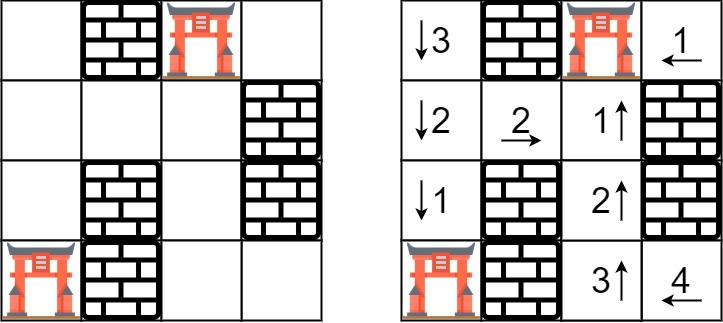

# 286. Walls and Gates


You are given an `m x n` grid `rooms` initialized with these three possible values.

* `-1` A wall or an obstacle.
* `0` A gate.
* `INF` Infinity means an empty room. We use the value `2^31 - 1 = 2147483647` to represent `INF` as you may assume that the distance to a gate is less than `2147483647`.
Fill each empty room with the distance to its nearest gate. If it is impossible to reach a gate, it should be filled with INF.

  
**Example 1:**




>**Input**: rooms = [[2147483647,-1,0,2147483647],[2147483647,2147483647,2147483647,-1],[2147483647,-1,2147483647,-1],[0,-1,2147483647,2147483647]]  
**Output**: [[3,-1,0,1],[2,2,1,-1],[1,-1,2,-1],[0,-1,3,4]]  


**Example 2:**

>**Input**: rooms = [[-1]]  
**Output**: [[-1]]  
 

**Constraints:**

* `m == rooms.length`
* `n == rooms[i].length`
* `1 <= m, n <= 250`
* `rooms[i][j]` is `-1`, `0`, or `2^31 - 1`.


## BFS + Queue + Matrix
```python
class Solution:
    def wallsAndGates(self, rooms: List[List[int]]) -> None:
        """
        Do not return anything, modify rooms in-place instead.
        """
        # Matrix: 4 directions
        # BFS: start from all Gates
        # Level: 
        
        #                                     process 1u q.add((1u)udlr)
        # Gate1: process root1, q.add(1udlr), process 1d q.add((1d)udlr) 
        #                                     process 1l q.add((1l)udlr)
        #                                     process 1r q.add((1r)udlr)

        #                                     process 2u q.add((2u)udlr)
        # Gate2: process root2, q.add(2udlr), process 2d q.add((2d)udlr) 
        #                                     process 2l q.add((2l)udlr)
        #                                     process 2r q.add((2r)udlr)
        # ...
        WALL, GATE, EMPTY = -1, 0, 2**31-1
        rows, cols = len(rooms), len(rooms[0])

        # for each point, there are 4 directions to got
        DIRECTIONS = [
            (1, 0),     # down
            (-1, 0),    # up
            (0, 1),     # right
            (0, -1)     # left
        ]

        # start from all gates, so add all gates locations into queue
        dq = collections.deque()
        for row in range(rows):
            for col in range(cols):
                if rooms[row][col] == GATE:
                    dq.append((row, col))
        
        # start to move from each gate
        while dq:
            # pop a gate from queue, until there's no more rooms to move
            point = dq.popleft()
            row = point[0]
            col = point[1]
            # move from gate to a new point(r, c)
            for direction in DIRECTIONS:
                r = row + direction[0]
                c = col + direction[1]
                # after movement, out of boundary, or not empty room, reach the end
                if (r < 0 or c < 0 or r >= rows or c >= cols or rooms[r][c] != EMPTY):
                    continue
                
                # process the new point we reached, update the steps from GATE
                # new room steps from GATE = previous room steps + 1
                rooms[r][c] = rooms[row][col] + 1
                # valid empty room, add it to queue for next round traversal
                dq.append((r, c))
```
