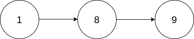
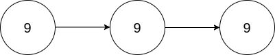

# 2816. Double a Number Represented as a Linked List

You are given the `head` of a **non-empty** linked list representing a non-negative integer without leading zeroes.

Return *the `head` of the linked list after doubling it.*


**Example 1:**



>Input: head = [1,8,9]  
Output: [3,7,8]  
Explanation: The figure above corresponds to the given linked list which represents the number 189. Hence, the returned linked list represents the number 189 * 2 = 378.  

**Example 2:**



>Input: head = [9,9,9]  
Output: [1,9,9,8]  
Explanation: The figure above corresponds to the given linked list which represents the number 999. Hence, the returned linked list reprersents the number 999 * 2 = 1998.   
 

**Constraints:**

* The number of nodes in the list is in the range `[1, 104]`
* 0 <= Node.val <= 9
* The input is generated such that the list represents a number that does not have leading zeros, except the number 0 itself.


## Pattern

1. Num digits, least significant --> most significant, Reverse.
2. Reverse Iteration --> Stack.
3. Create new Node, pointing head pointer to this new Node.
4. Step by Step, if confused, separate one step to multiple ones.


## Stack(LinkedList Reverse Iteration)

```python
# Definition for singly-linked list.
# class ListNode:
#     def __init__(self, val=0, next=None):
#         self.val = val
#         self.next = next
class Solution:
    def doubleIt(self, head: Optional[ListNode]) -> Optional[ListNode]:
        # reverse iteration with stack
        stack = []
        curr = head
        while curr:
            stack.append(curr.val)
            curr = curr.next

        result_list = None
        carry = 0
        while stack:
            num = stack.pop() * 2 + carry
            remain = num % 10
            carry = num // 10
            curr_node = ListNode(remain, result_list)    # create new node as new HEAD
            result_list = curr_node    # result_list points to new head
            
        # one more digit longer than original num
        if carry != 0:
            node = ListNode(carry, result_list)
            result_list = node
        return result_list
```

