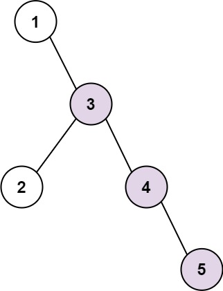
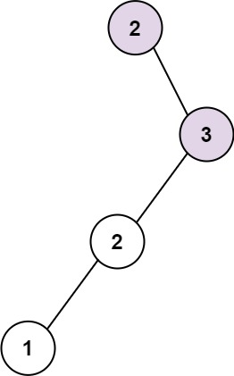

# 298. Binary Tree Longest Consecutive Sequence

Given the `root` of a binary tree, return *the length of the longest **consecutive sequence path**.*

A **consecutive sequence path** is a path where the values **increase by one** along the path.

Note that the path can start **at any node** in the tree, and you cannot go from a node to its parent in the path.


**Example 1:**




>Input: root = [1,null,3,2,4,null,null,null,5]  
Output: 3  
Explanation: Longest consecutive sequence path is 3-4-5, so return 3.  


**Example 2:**



>Input: root = [2,null,3,2,null,1]  
Output: 2  
Explanation: Longest consecutive sequence path is 2-3, not 3-2-1, so return 2.  
 

**Constraints:**

* The number of nodes in the tree is in the range `[1, 3 * 104]`.
* `-3 * 104 <= Node.val <= 3 * 104`

## DFS + Length(Path)

```python
# Definition for a binary tree node.
# class TreeNode:
#     def __init__(self, val=0, left=None, right=None):
#         self.val = val
#         self.left = left
#         self.right = right
class Solution:
    def __init__(self):
        self.max_length = 0

    def longestConsecutive(self, root: Optional[TreeNode]) -> int:

        # dfs, update longest sequence if requirement matches
        def dfs(node, parent, length):
            if not node:
                return
            # current node strictly increase 1, update current length
            if parent and node.val - parent.val == 1:
                length += 1
            # KEY: if current node not strictly increase 1, reset the length
            else:
                length = 1
            # update max_length
            self.max_length = max(self.max_length, length)
            # current node will be the new parent
            dfs(node.left, node, length)
            dfs(node.right, node, length)
        dfs(root, None, 0)        
        return self.max_length
```
