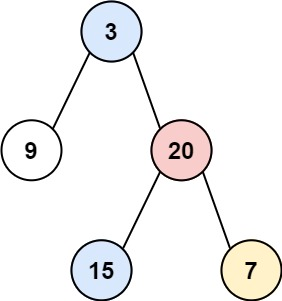

# 314. Binary Tree Vertical Order Traversal

Given the `root` of a binary tree, return ***the vertical order traversal** of its nodes' values.* (i.e., from top to bottom, column by column).

If two nodes are in the same row and column, the order should be from **left to right**.

 


**Example 1:**




**Input:** `root = [3,9,20,null,null,15,7]`  
**Output:** `[[9],[3,15],[20],[7]]`


**Example 2:**


**Input:** `root = [3,9,8,4,0,1,7]`  
**Output:** `[[4],[9],[3,0,1],[8],[7]]`


**Example 3:**


**Input:** `root = [3,9,8,4,0,1,7,null,null,null,2,5]`  
**Output:** `[[4],[9,5],[3,0,1],[8,2],[7]]`
 


**Constraints:**

* The number of nodes in the tree is in the range `[0, 100]`.
* `-100 <= Node.val <= 100`


## BFS + Deque + Hash Table
```python
# Definition for a binary tree node.
# class TreeNode:
#     def __init__(self, val=0, left=None, right=None):
#         self.val = val
#         self.left = left
#         self.right = right
class Solution:
    def verticalOrder(self, root: Optional[TreeNode]) -> List[List[int]]:
        if not root: return []
        # column index starts from 0, the root, left -1, right +1
        dq = collections.deque([(root, 0)])
        # hash table stores each column of the results {col_idx: [...nodes_val]}
        cols = {}
        while dq:
            # get new cur, new col idx
            cur, col = dq.popleft()

            # save value into related col
            if col not in cols:
                cols[col] = []
            cols[col].append(cur.val)    

            # push children into dequeue
            if cur.left:
                dq.append((cur.left, col - 1))
            if cur.right:
                dq.append((cur.right, col + 1))
        # sorted by column index
        return [vals for col, vals in sorted(cols.items())]
```
