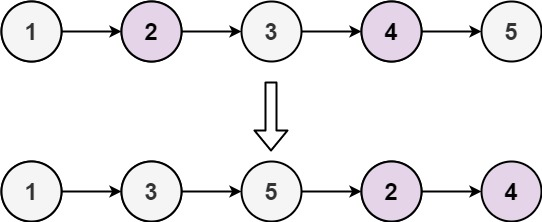
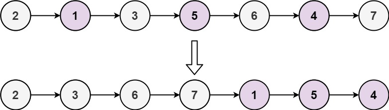

# 328. Odd Even Linked List

Given the `head` of a singly linked list, group all the nodes with odd indices together followed by the nodes with even indices, and return the reordered list.

The first node is considered odd, and the second node is even, and so on.

Note that the relative order inside both the even and odd groups should remain as it was in the input.

You must solve the problem in `O(1)` extra space complexity and `O(n)` time complexity.

 

**Example 1:**

```
Input: head = [1,2,3,4,5]
Output: [1,3,5,2,4]
```

**Example 2:**

```
Input: head = [2,1,3,5,6,4,7]
Output: [2,3,6,7,1,5,4]
```

**Constraints:**

* `The number of nodes in the linked list is in the range [0, 104].`
* `-106 <= Node.val <= 106`


## Solution

```python
# Definition for singly-linked list.
# class ListNode:
#     def __init__(self, val=0, next=None):
#         self.val = val
#         self.next = next
class Solution:
    def oddEvenList(self, head: Optional[ListNode]) -> Optional[ListNode]:
        """Divide & Merge"""
        if not head: return head
        even_head = head.next   # save first even node for reconnection
        odd, even = head, even_head
        # even.next exists to ensure last odd always exists
        while even and even.next:
            odd.next = even.next  # connect to next odd index node
            odd = odd.next        # move odd pointer forward for even to use
            even.next = odd.next  # connect to next even index node
            even = even.next      # move even pointer forward fro odd to use
        # connect last odd node and first even node
        odd.next = even_head
        return head
```
