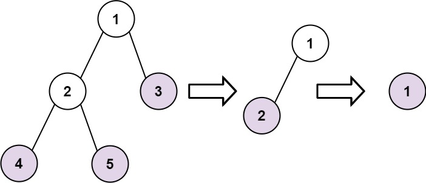

# 366. Find Leaves of Binary Tree

Given the `root` of a binary tree, collect a tree's nodes as if you were doing this:

* Collect all the leaf nodes.
* Remove all the leaf nodes.
* Repeat until the tree is empty.
 

**Example 1:**



>**Input:** `root = [1,2,3,4,5]`  
**Output:** `[[4,5,3],[2],[1]]`  
**Explanation:**
`[[3,5,4],[2],[1]] and [[3,4,5],[2],[1]] are also considered correct answers since per each level it does not matter the order on which elements are returned.`


**Example 2:**

>**Input:** `root = [1]`  
**Output:** `[[1]]`
 

**Constraints:**

* The number of nodes in the tree is in the range `[1, 100]`.
* `-100 <= Node.val <= 100`


## DFS + Hash Table
This one is a much better solution.
Learn how to disconnect the outer layer with decency.

```python
# Definition for a binary tree node.
# class TreeNode:
#     def __init__(self, val=0, left=None, right=None):
#         self.val = val
#         self.left = left
#         self.right = right
class Solution:
    def findLeaves(self, root: Optional[TreeNode]) -> List[List[int]]:

        res = []
        def dfs(root):
            if not root:
                return 
            # leaf node found
            if not root.left and not root.right:
                # rightmost list will always be the current layer
                res[-1].append(root.val)
                return 
            # KEY: Decent way to DISCONNECT!
            root.left = dfs(root.left)
            root.right = dfs(root.right)
            # only disconnect leaf node, current root will be return
            return root
        
        while root:
            # [] stores leaves for current layer
            res.append([])
            # new root has disconnected from all leaves
            root = dfs(root)
        return res
```


## DFS + Hash Table + Counting layer + Sorting

```python
# Definition for a binary tree node.
# class TreeNode:
#     def __init__(self, val=0, left=None, right=None):
#         self.val = val
#         self.left = left
#         self.right = right
class Solution:
    def findLeaves(self, root: Optional[TreeNode]) -> List[List[int]]:
        # Tree height count by return addition, outer layer --> inner layer
        # Hash Table stores {layer: [...values]}
        res = collections.defaultdict(list)

        def dfs(root, layer):
            # keep going one side until reaching the end, the first layer will always be 0
            if not root: return layer

            # layer count of current left/right subtree
            left = dfs(root.left, layer)
            right = dfs(root.right, layer)
            
            # current layer is the inner layer, as the outer layer has been counted before
            layer = max(left, right)

            # append value to current layer
            res[layer].append(root.val)

            # layer addtion starts from returning, just like height
            return layer + 1
        
        dfs(root, 0)
        return [vals for _, vals in sorted(res.items())]
```
