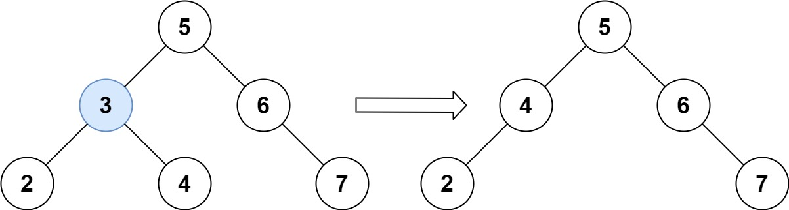
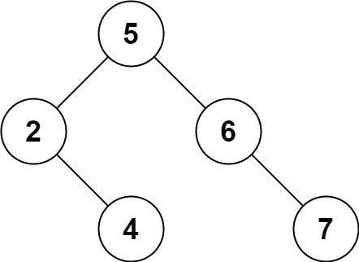

# 450. Delete Node in a BST

Given a root node reference of a BST and a key, delete the node with the given key in the BST. Return the **root node reference** (possibly updated) of the BST.

Basically, the deletion can be divided into two stages:

Search for a node to remove.
If the node is found, delete the node.
 

**Example 1:**

```
Input: root = [5,3,6,2,4,null,7], key = 3
Output: [5,4,6,2,null,null,7]
Explanation: Given key to delete is 3. So we find the node with value 3 and delete it.
One valid answer is [5,4,6,2,null,null,7], shown in the above BST.
Please notice that another valid answer is [5,2,6,null,4,null,7] and it's also accepted.
```
**Example 2:**

```
Input: root = [5,3,6,2,4,null,7], key = 0
Output: [5,3,6,2,4,null,7]
Explanation: The tree does not contain a node with value = 0.
```
**Example 3:**
```
Input: root = [], key = 0
Output: []
``` 

**Constraints:**

* `The number of nodes in the tree is in the range [0, 104].`
* `-105 <= Node.val <= 105`
* `Each node has a unique value.`
* `root is a valid binary search tree.`
* `-105 <= key <= 105`
 

**Follow up:** Could you solve it with time complexity `O(height of tree)`?

## Solution
```python
# Definition for a binary tree node.
# class TreeNode:
#     def __init__(self, val=0, left=None, right=None):
#         self.val = val
#         self.left = left
#         self.right = right
class Solution:
    def deleteNode(self, root: Optional[TreeNode], key: int) -> Optional[TreeNode]:
        # traverse to find the key, pre-order used here
        def find_min_node(root):
            cur = root
            # definition, left.val < parent.val
            while cur.left:
                cur = cur.left
            return cur

        if not root: return None
        # definition, left node val < parent's val, search left side
        if key < root.val:
            root.left = self.deleteNode(root.left, key)
        # definition, right node val > parent's val, search right side
        elif key > root.val:
            root.right = self.deleteNode(root.right, key)
        # target found
        else:
            # no children, delete itself, parent reconnect to None
            if not root.left and not root.right:
                return None
            # exclusive or: only left child exists, parent reconnect to left child
            if not root.left:
                return root.right
            # exclusive or: only right child exists, parent reconnect to right child
            if not root.right:
                return root.left
            # both child exists, min node of right child val > current root val
            right_min_child = find_min_node(root.right)
            # replace root val with smallest val of right child
            root.val = right_min_child.val
            # delete the min value we used
            root.right = self.deleteNode(root.right, right_min_child.val)
        return root
```
