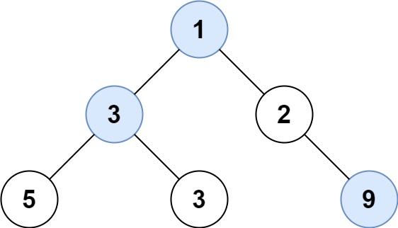

# 515. Find Largest Value in Each Tree Row

Given the `root` of a binary tree, return *an array of the largest value in each row* of the tree **(0-indexed)**.

**Example 1:**



**Input:** `root = [1,3,2,5,3,null,9]`    
**Output:** `[1,3,9]`  


**Example 2:**

**Input:** `root = [1,2,3]`    
**Output:** `[1,3]`  
 

**Constraints:**

* The number of nodes in the tree will be in the range `[0, 104]`.  
* `-231 <= Node.val <= 231 - 1`


## BFS
```python
# Definition for a binary tree node.
# class TreeNode:
#     def __init__(self, val=0, left=None, right=None):
#         self.val = val
#         self.left = left
#         self.right = right
class Solution:
    def largestValues(self, root: Optional[TreeNode]) -> List[int]:
        # BFS
        if not root:
            return []
        dq = collections.deque([root])
        res = []
        while dq:
            level_max = float('-inf')
            for _ in range(len(dq)):
                cur = dq.popleft()
                # update max value of current level
                level_max = max(level_max, cur.val)
                    
                if cur.left:
                    dq.append(cur.left)
                if cur.right:
                    dq.append(cur.right)
            # append level max to res
            res.append(level_max)
        return res
```
