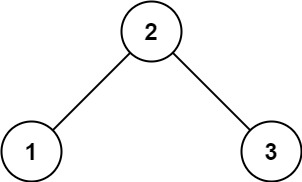

# 513. Find Bottom Left Tree Value

Given the `root` of a binary tree, return the leftmost value in the last row of the tree.

**Example 1:**


**Input:** `root = [2,1,3]`
**Output:** `1`


**Example 2:**


**Input:** `root = [1,2,3,4,null,5,6,null,null,7]`
**Output:** `7`
 

**Constraints:**

* The number of nodes in the tree is in the range `[1, 104]`.
* `-231 <= Node.val <= 231 - 1`

## Solution
```python
# Definition for a binary tree node.
# class TreeNode:
#     def __init__(self, val=0, left=None, right=None):
#         self.val = val
#         self.left = left
#         self.right = right
class Solution:
    def findBottomLeftValue(self, root: Optional[TreeNode]) -> int:
        """BFS, with deque, update level"""
        dq = collections.deque([root])
        last_level = list()
        while dq:
            level = list()
            for i in range(len(dq)):
                cur = dq.popleft()
                level.append(cur)
                if cur.left:
                    dq.append(cur.left)
                if cur.right:
                    dq.append(cur.right)
            # update last level
            last_level = level
        return last_level[0].val
```
