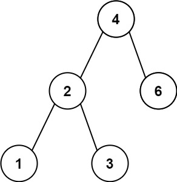

# 530. Minimum Absolute Difference in BST


Given the `root` of a Binary Search Tree (BST), return *the minimum absolute difference between the values of any two different nodes in the tree*.

 

**Example 1:**



>**Input:** root = [4,2,6,1,3]  
**Output:** 1


**Example 2:**


>**Input:** root = [1,0,48,null,null,12,49]  
**Output:** 1
 

**Constraints:**

* The number of nodes in the tree is in the range `[2, 104]`.
* `0 <= Node.val <= 105`


## Solution
```python
# Definition for a binary tree node.
# class TreeNode:
#     def __init__(self, val=0, left=None, right=None):
#         self.val = val
#         self.left = left
#         self.right = right
class Solution:
    def getMinimumDifference(self, root: Optional[TreeNode]) -> int:
        """inorder traverse on BST is sorted array"""
        stack = list()
        ordered = list()
        cur = root
        while cur or stack:
            # left -> root: reach the end of left, back to handle current root
            if not cur:
                # action happens during pop
                cur = stack.pop()
                ordered.append(cur)
                # root -> right
                cur = cur.right
            # left->left->... keep going left till the end
            else:
                stack.append(cur)
                cur = cur.left
        min_ = float('inf')
        for i in range(1, len(ordered)):
            diff = abs(ordered[i].val - ordered[i-1].val)
            min_ = min(min_, diff)
        return min_
```

Question is exactly the same as [783](../781-790/783.%20Minimum%20Absolute%20Difference%20in%20BST.md). 
