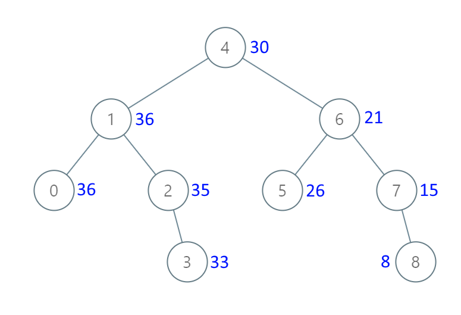

# 538. Convert BST to Greater Tree

Given the `root` of a Binary Search Tree (BST), convert it to a Greater Tree such that every key of the original BST is changed to the original key plus the sum of all keys greater than the original key in BST.

As a reminder, a binary search tree is a tree that satisfies these constraints:

* The left subtree of a node contains only nodes with keys less than the node's key.
* The right subtree of a node contains only nodes with keys greater than the node's key.
* Both the left and right subtrees must also be binary search trees.
 

**Example 1:**


>Input: root = [4,1,6,0,2,5,7,null,null,null,3,null,null,null,8]  
Output: [30,36,21,36,35,26,15,null,null,null,33,null,null,null,8]  



**Example 2:**

>Input: root = [0,null,1]  
Output: [1,null,1]  
 

**Constraints:**

* The number of nodes in the tree is in the range `[0, 104]`.
* `-104 <= Node.val <= 104`
* All the values in the tree are **unique**.
* `root` is guaranteed to be a valid binary search tree.
 

Note: This question is the same as 1038: https://leetcode.com/problems/binary-search-tree-to-greater-sum-tree/


## DFS Recursive(JAVA)


```java
/**
 * Definition for a binary tree node.
 * public class TreeNode {
 *     int val;
 *     TreeNode left;
 *     TreeNode right;
 *     TreeNode() {}
 *     TreeNode(int val) { this.val = val; }
 *     TreeNode(int val, TreeNode left, TreeNode right) {
 *         this.val = val;
 *         this.left = left;
 *         this.right = right;
 *     }
 * }
 */
class Solution {

    int currTotal = 0;
    
    public TreeNode convertBST(TreeNode root) {
        // DFS Recursive
        if (root == null){
            return null;
        }
        convertBST(root.right);     // keep going right
        currTotal += root.val;      // update current total, current value accumulated
        root.val = currTotal;       // update current value to accumulated value
        convertBST(root.left);
        return root;
    }
}
```


## DFS Iterative(InOrder) Stack(JAVA)


```java
/**
 * Definition for a binary tree node.
 * public class TreeNode {
 *     int val;
 *     TreeNode left;
 *     TreeNode right;
 *     TreeNode() {}
 *     TreeNode(int val) { this.val = val; }
 *     TreeNode(int val, TreeNode left, TreeNode right) {
 *         this.val = val;
 *         this.left = left;
 *         this.right = right;
 *     }
 * }
 */
class Solution {

    int currTotal = 0;
    
    public TreeNode convertBST(TreeNode root) {

        // DFS Iterative Stack, similar to inorder, right mid left
        Stack<TreeNode> stack = new Stack<>();
        TreeNode curr = root;
        // keep going right and append
        while (!stack.isEmpty() || curr != null){
            if (curr != null){
                stack.addLast(curr);
                curr = curr.right;
            }
            // no more right, pop and accumulated to total, then go left
            else{
                curr = stack.pop();
                currTotal += curr.val;      // update current total, current value accumulated
                curr.val = currTotal;       // update current value to accumulated value
                curr = curr.left;           // go left
            }
        }
        return root;
    }
}
```


## DFS Recursive(Python)

```python
# Definition for a binary tree node.
# class TreeNode:
#     def __init__(self, val=0, left=None, right=None):
#         self.val = val
#         self.left = left
#         self.right = right
class Solution:
    def __init__(self):
        self.curr_sum = 0

    def convertBST(self, root: Optional[TreeNode]) -> Optional[TreeNode]:
        # DFS Recursive
        def dfs(node):
            if not node:
                return
            dfs(node.right)                 # keep going right
            self.curr_sum += node.val       # start from bottom, add up bigger values
            node.val = self.curr_sum        # update curr value to accumulated sum
            dfs(node.left)
        dfs(root)
        return root
```


## DFS Iterative(InOrder) Stack(Python)

```python
# Definition for a binary tree node.
# class TreeNode:
#     def __init__(self, val=0, left=None, right=None):
#         self.val = val
#         self.left = left
#         self.right = right
class Solution:
    def __init__(self):
        self.curr_sum = 0

    def convertBST(self, root: Optional[TreeNode]) -> Optional[TreeNode]:
        # DFS Iterative In-Order(Stack)
        if not root:
            return
        curr = root    
        stack = []
        total = 0
        while stack or curr:
            # keep appending base on the direction we go
            if curr:
                stack.append(curr)
                curr = curr.right
            # no more right, return to current node and go LEFT
            else:
                curr = stack.pop()
                total += curr.val
                curr.val = total
                curr = curr.left
        return root
```
