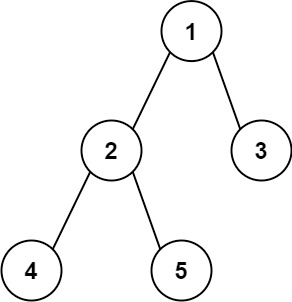

# 543. Diameter of Binary Tree

Given the `root` of a binary tree, return *the length of the **diameter** of the tree*.

The **diameter** of a binary tree is the **length** of the longest path between any two nodes in a tree. This path may or may not pass through the `root`.

The length of a path between two nodes is represented by the number of edges between them.

 

**Example 1:**


>**Input:** `root = [1,2,3,4,5]`    
**Output:** `3`  
**Explanation:** `3 is the length of the path [4,2,1,3] or [5,2,1,3].`

**Example 2:**

>**Input:** `root = [1,2]`  
**Output:** `1`
 

**Constraints:**

* The number of nodes in the tree is in the range `[1, 104]`.
* `-100 <= Node.val <= 100`

## Solution

```python
# Definition for a binary tree node.
# class TreeNode:
#     def __init__(self, val=0, left=None, right=None):
#         self.val = val
#         self.left = left
#         self.right = right
class Solution:
    def diameterOfBinaryTree(self, root: Optional[TreeNode]) -> int:
        """DFS, height calculation"""
        # Diameter: Longest Path between ANY TWO NODES! So we need to update max diameter every time coming back from recursion
        # Diameter: Not necessary go through root!
        # two nodes diameter = left tree max depth + right tree max depth
        # remember, depth calculation starts from the BOTTOM, when recursion goes BACK, +1

        # max_diameter
        self.max_dia = 0
        def depth(root):
            # empty node has no height
            if not root: return 0
            left = depth(root.left)
            right = depth(root.right)
            # current diameter between left and right = current left depth + current right depth
            dia = left + right
            # update max diameter
            self.max_dia = max(self.max_dia, dia)
            # always choose higher subtree for depth accumulation
            return max(left, right) + 1
        depth(root)
        return self.max_dia
```
