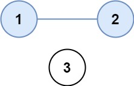
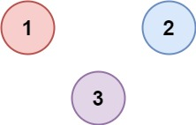

# 547. Number of Provinces

There are `n` cities. Some of them are connected, while some are not. If city `a` is connected directly with city `b`, and city `b` is connected directly with city `c`, then city `a` is connected indirectly with city `c`.

A **province** is a group of directly or indirectly connected cities and no other cities outside of the group.

You are given an `n x n` matrix `isConnected` where `isConnected[i][j] = 1` if the `i^th` city and the `j^th` city are directly connected, and `isConnected[i][j] = 0` otherwise.

Return *the total number of **provinces**.*

 

**Example 1:**



>Input: isConnected = [[1,1,0],[1,1,0],[0,0,1]]  
Output: 2  

**Example 2:**



>Input: isConnected = [[1,0,0],[0,1,0],[0,0,1]]  
Output: 3  
 

**Constraints:**

* `1 <= n <= 200`
* `n == isConnected.length`
* `n == isConnected[i].length`
* `isConnected[i][j]` is `1` or `0`.
* `isConnected[i][i] == 1`
* `isConnected[i][j] == isConnected[j][i]`

## Graph: Disjoint Set

**Optimization: Quick Union + Path Compression**

```python
class DisjointSet:
    def __init__(self, size):
        # Quick Union: array stores parents, O(1) to change root
        self.parents = [i for i in range(size)]
        # Optimization: each vertices starts with rank 1(the height), not connected to anyone
        self.ranks = [1] * size

    def find(self, x):
        # giving vertice, find its root
        # Optimization: update all parents into root with recursion during searching
        # find -> find -> find -> ...
        # update <- update <- update <- ...
        if x != self.parents[x]:
            self.parents[x] = self.find(self.parents[x])
        return self.parents[x]

    def union(self, x, y):
        # connect 2 vertice, make the roots of them the same
        root_x = self.find(x)            
        root_y = self.find(y)
        # already connected, no need to do anything
        if root_x == root_y:
            return
        # always connect shorter one taller one
        if self.ranks[root_x] > self.ranks[root_y]:
            self.parents[root_y] = root_x
        elif self.ranks[root_x] < self.ranks[root_y]:
            self.parents[root_x] = root_y
        # same height, choose whichever
        else:
            self.parents[root_y] = root_x
            self.ranks[root_x] += 1
            

class Solution:

    def findCircleNum(self, isConnected: List[List[int]]) -> int:
        # convert matrix to disjoint set
        # max provinces we can get is n, each union -1 vertices(provinces)  
        n = len(isConnected)
        # initialize the disjoint set
        ds = DisjointSet(n)
        provinces = n
        for row in range(n):
            # 1->2 is same as 2->1 if they are connected, no need to check backward
            for col in range(row+1, n):
                # connect vertices i and j, provinces -1
                if isConnected[row][col] and ds.find(row) != ds.find(col):
                    ds.union(row, col)
                    provinces -= 1
        return provinces
```


## Graph: DFS
TODO

## Graph: BFS
TODO