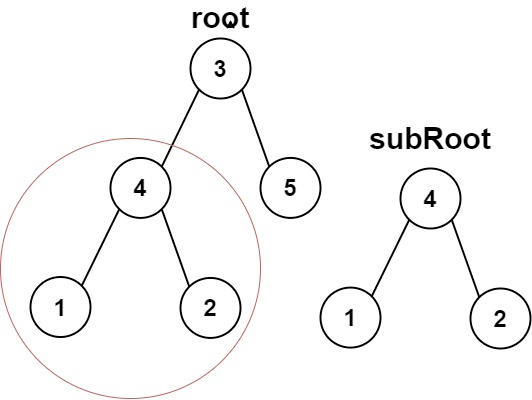

# 572. Subtree of Another Tree

Given the roots of two binary trees `root` and `subRoot`, return `true` if there is a subtree of `root` with the same structure and node values of `subRoot` and `false` otherwise.

A subtree of a binary tree `tree` is a tree that consists of a node in `tree` and all of this node's descendants. The tree `tree` could also be considered as a subtree of itself.


**Example 1:**


>**Input:** `root = [3,4,5,1,2], subRoot = [4,1,2]`  
**Output:** `true`


**Example 2:**


>**Input:** `root = [3,4,5,1,2,null,null,null,null,0], subRoot = [4,1,2]`  
**Output:** `false`
 

**Constraints:**

* The number of nodes in the root tree is in the range `[1, 2000]`.
* The number of nodes in the subRoot tree is in the range `[1, 1000]`.
* `-104 <= root.val <= 104`
* `-104 <= subRoot.val <= 104`


## Solution
```python
# Definition for a binary tree node.
# class TreeNode:
#     def __init__(self, val=0, left=None, right=None):
#         self.val = val
#         self.left = left
#         self.right = right
class Solution:
    def isSubtree(self, root: Optional[TreeNode], subRoot: Optional[TreeNode]) -> bool:
        """DFS, figure out all cases"""
        def same(root, subroot):
            # reach the end at the same time
            if not root and not subroot:
                return True
            # both not None with same value, go for children
            if root and subroot and root.val == subroot.val:
                return same(root.left, subroot.left) and same(root.right, subroot.right)
            # they are not the same, either one is None, or diff value
            return False

        # empty tree is always a subtree
        if not subRoot:
            return True
        # empty root does not have subtree
        if not root:
            return False
        # call same to check current root
        if same(root, subRoot):
            return True
        # keep looking for the same node in children
        return self.isSubtree(root.left, subRoot) or self.isSubtree(root.right, subRoot)
```
