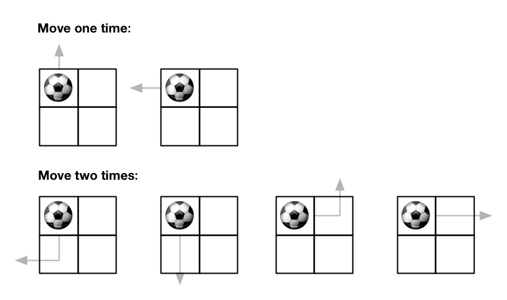
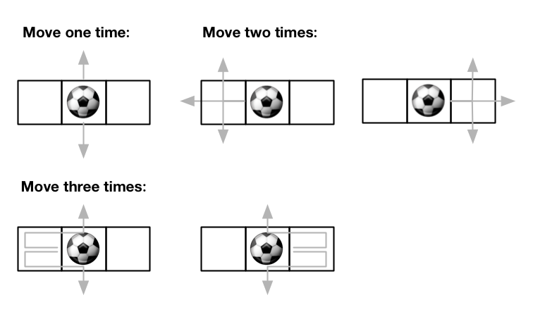

# 576. Out of Boundary Paths


There is an `m x n` grid with a ball. The ball is initially at the position `[startRow, startColumn]`. You are allowed to move the ball to one of the four adjacent cells in the grid (possibly out of the grid crossing the grid boundary). You can apply at most `maxMove` moves to the ball.

Given the five integers `m`, `n`, `maxMove`, `startRow`, `startColumn`, return the number of paths to move the ball out of the grid boundary. Since the answer can be very large, return it modulo `10^9 + 7`.

 

**Example 1:**



>**Input**: m = 2, n = 2, maxMove = 2, startRow = 0, startColumn = 0  
**Output**: 6  


**Example 2:**



>**Input**: m = 1, n = 3, maxMove = 3, startRow = 0, startColumn = 1  
**Output**: 12  

**Constraints:**

* `1 <= m, n <= 50`
* `0 <= maxMove <= 50`
* `0 <= startRow < m`
* `0 <= startColumn < n`


```python
class Solution:

    def findPaths(self, m: int, n: int, maxMove: int, startRow: int, startColumn: int) -> int:
        # (DFS)Recursion + Memoization
        # Status: memo[startRow][startColumn] = {maxMove1: success+1/fail+0, 
        #                                        maxMove2: success+1/fail+0, ...}
        # Recursion Relation:
        # findPaths(...maxMove,...) = findPaths(...maxMove-1,...)
        # Base Case:
        # out of boundary or maxMove == 0
        MOD = 10**9 + 7
        memo = [[{} for _ in range(n)] for _ in range(m)]

        def find(maxMove, startRow, startColumn):
            # out of boundary
            if startRow == m or startColumn == n or startRow < 0 or startColumn < 0:
                return 1
            # run out of moves
            if maxMove == 0:
                return 0
            # been here before, get the previous result
            if maxMove in memo[startRow][startColumn]:
                return memo[startRow][startColumn][maxMove]
            
            # store the # paths into current spot
            memo[startRow][startColumn][maxMove] = find(maxMove - 1, startRow-1, startColumn)  + \
                                                   find(maxMove - 1, startRow+1, startColumn)  + \
                                                   find(maxMove - 1, startRow, startColumn-1)  + \
                                                   find(maxMove - 1, startRow, startColumn+1) 
            return memo[startRow][startColumn][maxMove]

        return find(maxMove, startRow, startColumn) % MOD
```
