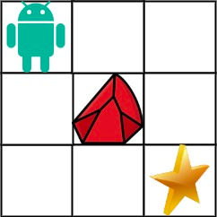

# 63. Unique Paths II

You are given an `m x n` integer array `grid`. There is a robot initially located at the **top-left corner** (i.e., `grid[0][0]`). The robot tries to move to the **bottom-right corner** (i.e., `grid[m - 1][n - 1]`). The robot can only move either down or right at any point in time.

An obstacle and space are marked as `1` or `0` respectively in `grid`. A path that the robot takes cannot include any square that is an obstacle.

Return *the number of possible unique paths that the robot can take to reach the bottom-right corner*.

The testcases are generated so that the answer will be less than or equal to `2 * 10^9`.


**Example 1:**



>**Input**: obstacleGrid = [[0,0,0],[0,1,0],[0,0,0]]  
**Output**: 2  
**Explanation**: There is one obstacle in the middle of the 3x3 grid above.  
There are two ways to reach the bottom-right corner:  
>1. Right -> Right -> Down -> Down  
>2. Down -> Down -> Right -> Right  


**Example 2:**


>**Input**: obstacleGrid = [[0,1],[0,0]]  
**Output**: 1  
 

**Constraints:**

`m == obstacleGrid.length`
`n == obstacleGrid[i].length`
`1 <= m, n <= 100`
`obstacleGrid[i][j]` is `0` or `1`.


## 2D-DP-Top Down: Recursion + Memoization

1. **State**
   * `dp[row][col]` stores possible unique paths to reach this point
2. **Recursion Relation**
   * `dp[row][col] = dp[row][col-1] + dp[row-1][col]`
3. **Base Case**
   * row col stay in bounds
   * `dp[0][0] = 1`
   * if `dp[row][col] == -1`, obstacle, return 0, impossible to reach


```python
class Solution:
    def uniquePathsWithObstacles(self, obstacleGrid: List[List[int]]) -> int:


        rows, cols = len(obstacleGrid), len(obstacleGrid[0])
        # edge cases: destination or start point is obstacle, impossbile to reach
        if obstacleGrid[rows-1][cols-1] == 1 or obstacleGrid[0][0] == 1:
            return 0

        # initialize the obstacles in grid to -1        
        for row in range(rows):
            for col in range(cols):
                if obstacleGrid[row][col] == 1:
                    obstacleGrid[row][col] = -1

        # Base Case
        obstacleGrid[0][0] = 1

        def dp(row, col):
            if row < 0 or row > rows-1 or col < 0 or col > cols-1 or obstacleGrid[row][col] == -1:
                return 0
            # not memorized, process it
            if obstacleGrid[row][col] == 0:
                obstacleGrid[row][col] = dp(row, col-1) + dp(row-1, col)
            return obstacleGrid[row][col]

        dp(rows-1, cols-1)
        return obstacleGrid[rows-1][cols-1]
```


## 2D-DP-Bottom Up: Iteration + 2D Array

1. **Status**
   * `dp[row][col]` stores unique paths to this point
2. **Recursion Relation**
   * `dp[row][col] = dp[row][col-1] + dp[row-1][col]`
3. **Base Case & Edge Cases**
   * `dp[0][0]` and `dp[rows-1][cols-1]` is obstacle, return `0`
   * `dp[0][0] = 1`

```python
class Solution:
    def uniquePathsWithObstacles(self, obstacleGrid: List[List[int]]) -> int:
        # no need for extra rows and cols
        # process row 0 and col 0, turn obstacle 1 to 0 as it's impossible to reach
        rows, cols = len(obstacleGrid), len(obstacleGrid[0])

        if obstacleGrid[0][0] == 1 or obstacleGrid[rows-1][cols-1] == 1:
            return 0
        
        # base case: num of ways to reach this point
        obstacleGrid[0][0] = 1

        # go through upmost and leftmost lane, turn obstacle into 0, filling values
        for c in range(1, cols):
            obstacleGrid[0][c] = 0 if obstacleGrid[0][c] == 1 else obstacleGrid[0][c-1]
        
        for r in range(1, rows):
            obstacleGrid[r][0] = 0 if obstacleGrid[r][0] == 1 else obstacleGrid[r-1][0]

        # start from dp[1][1]
        for row in range(1, rows):
            for col in range(1, cols):
                # turn obstacle into 0 as it's not reachable
                if obstacleGrid[row][col] == 1:
                    obstacleGrid[row][col] = 0
                else:
                    obstacleGrid[row][col] = obstacleGrid[row][col-1] + obstacleGrid[row-1][col]
        
        return obstacleGrid[rows-1][cols-1]
```
